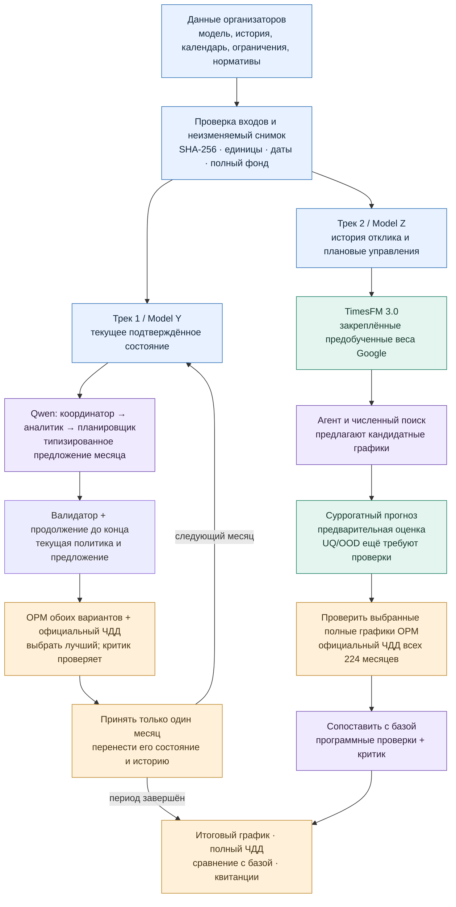
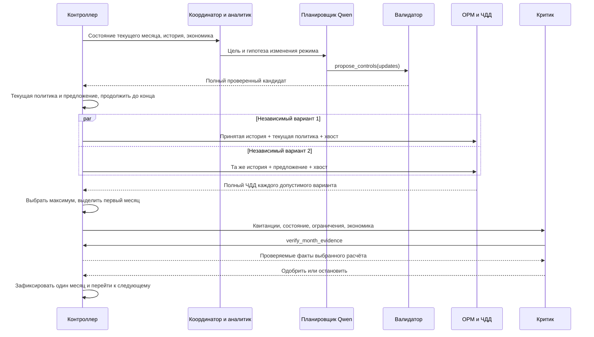
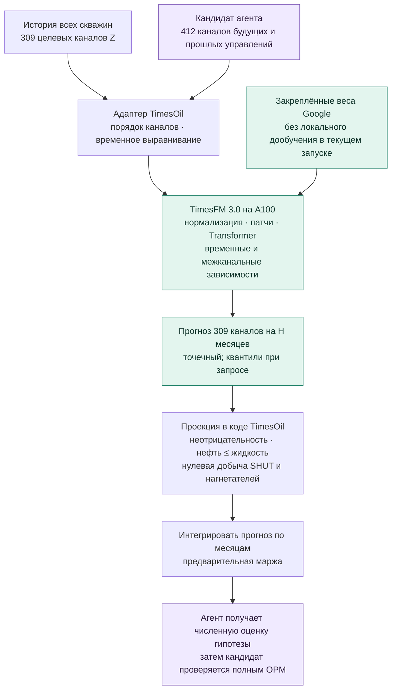
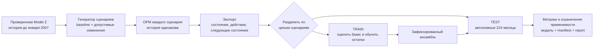
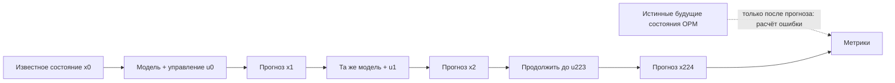

# TimesOil · От исходных данных до ЧДД

### Подробный алгоритм двух треков: агенты, суррогат, физика и экономика

**Срез реализации: 9 сентября 2026.** Трек 1: `088313f`; физический цикл
Трека 2: `2bd936c`; эксперимент дообучения TimesFM: `a47ba03`.
Документ описывает действующий код и отдельно отмечает незавершённые проверки.
Периоды ниже относятся к имеющимся **учебным** Model Y и Model Z.

> **Главная идея.** Агент предлагает, какие режимы попробовать и почему.
> Суррогат быстро оценивает последствия управления там, где он подключён.
> OPM рассчитывает физическую траекторию. Официальный калькулятор переводит
> её в деньги. Программные проверки и критик определяют допустимость результата.

| | **Трек 1 · Model Y** | **Трек 2 · Model Z** |
|---|---|---|
| Принцип | Решение → исполнение месяца → новое состояние → новое решение | Предобученный TimesFM → оценка политик → полный физический пересчёт |
| Фонд учебного кейса | 49 скважин | 103 скважины |
| Период управления | Январь 2014 — ноябрь 2015 | Январь 2007 — август 2025 |
| Экономический горизонт | **23 месяца** | **224 месяца** |
| Роль агента | Предложить изменения текущего месяца для полного фонда | Предложить политику или направление поиска; проверить результаты |
| Основной прогнозный путь | TimesFM исследован; **в проверенном lifecycle-цикле не подключён** | **Google TimesFM 3.0** для прогнозов и предварительной оценки политик |
| Кто выбирает окончательно | Программный максимум полного ЧДД среди допустимых продолжений; затем критик | Максимум полного официального ЧДД среди проверенных графиков и базы |
| Проверенный результат полного периода | 1 030,883174 млн руб.; **0%** к базе | 12 855,567000 млн руб.; **+8,263414%** к базе |

**Как читать:** оглавление ведёт к этапам; блоки ▸ раскрывают технические детали.
Основной прогнозный модуль этого описания — **Google TimesFM 3.0**. CRM +
LightGBM сохранён как сравнительный контур в раскрываемом приложении.
TimesFM получил BHP и изменения скважин по датам. Полный физический цикл
после такого скрининга дал +1,244836% к новой парной базе, но критик не
подтвердил суррогатный допуск из-за незакрытых UQ/OOD.
[Новый опыт и его пределы](CONTROL_COST_GAPS_20260909.md#полный-физический-цикл-после-скрининга-timesfm-с-bhp).

Диаграммы Mermaid и формулы отображаются в Markdown-просмотрщике с их поддержкой.
Текст, таблицы и псевдокод сохраняют смысл без рендеринга диаграмм.

| Маршрут чтения | Разделы |
|---|---|
| Понять назначение системы | [Общая схема](#overview) → [Кто что делает](#roles) → [Результаты](#status) |
| Разобраться с агентами | [Вход агента](#agent-input) → [Месяц Трека 1](#track1) → [Поиск Трека 2](#track2-search) |
| Разобраться с суррогатом | [Данные TimesFM](#training) → [Устройство модели](#surrogate) → [Автономный прогноз](#rollout) → [UQ/OOD](#uncertainty) |
| Проверить ЧДД | [Экспорт OPM](#export) → [Экономика](#economics) → [Доказательства](#evidence) |
| Проверить реализацию | [Ограничения](#constraints) → [Файлы кода](#code-map) → [Порядок запуска](#execution) |

---

<a id="overview"></a>
## 1. Полная схема: два пути к одному экономическому критерию



**Граница схемы.** Правая ветвь показывает назначение прогнозного контура TimesFM.
Готовность модели для каждого горизонта и типа воздействия подтверждается отдельно.
Лучший опубликованный график Z получен **прямыми предложениями Qwen после
предыдущих OPM-экспериментов**, а не новым BHP-суррогатом.
Следовательно, +8,263414% подтверждает конкретный физический эксперимент,
но само по себе не подтверждает качество обучаемого оптимизатора.

<details>
<summary><strong>▸ Словарь: пять разных сущностей, которые нельзя смешивать</strong></summary>

| Сущность | Что это | Что она не доказывает |
|---|---|---|
| Управление $u_t$ | Заданные дебит, статус, роль и допустимая граница давления | Что скважина физически достигнет заданного дебита |
| Состояние $x_t$ | Дебиты/давления на момент решения; для ГДМ также внутреннее состояние пласта | Что завтра состояние останется таким же |
| Прогноз $\hat x_{t+1}$ | Оценка отклика модели на управление | Фактическое соблюдение физических ограничений |
| Предварительный балл $S(u)$ | Дешёвый критерий сравнения вариантов | Официальный ЧДД |
| ЧДД $J(u)$ | Дисконтированные денежные потоки по фактическому OPM-отклику и нормативам | Глобальный оптимум или переносимость на новый кейс |

ГДМ — гидродинамическая модель. OPM Flow — используемый физический симулятор.
AIOS — программный контур вокруг LLM, инструментов, ограничений и расчётов.
MPC — управление с пересчётом решения после получения следующего состояния.
Суррогат — обученная приближённая модель перехода состояния.

</details>

<a id="roles"></a>
## 2. Кто именно что делает — и зачем

Четыре агентные роли — последовательные вызовы внешнего Qwen
`qwen3.8-27b` через API Татнефти (`https://litellm.tatneft.guru/v1`). Это разные инструкции и права инструментов
в одном управляемом процессе; они не являются четырьмя отдельно обученными
моделями. В текущем проекте локальная LLM не используется.
Переключение относится к обоим трекам и всем четырём ролям. Исторические
результаты ниже сохраняют исходного провайдера в своих квитанциях; смена
провайдера сама по себе не означает повторного физического расчёта.

| Исполнитель | Получает | Конкретное действие | Возвращает | Зачем нужен |
|---|---|---|---|---|
| **Координатор** | Цель, текущий этап, доступные данные и ограничения | Определяет следующий проверяемый шаг | Решение роли: сводка, рекомендация, основания, `approved` | Удерживает задачу и порядок действий |
| **Аналитик пласта** | Текущее состояние, история и решения предыдущих ролей | Объясняет, где растёт вода, падает отклик, меняются режимы; формирует гипотезу | Диагноз с опорой на переданные числа | Помогает выбирать осмысленные воздействия |
| **Планировщик** | Диагноз, разрешённые действия, экономический профиль | Вызывает разрешённый инструмент предложения/выбора | Типизированный кандидат; протокол вызова | Превращает текстовую гипотезу в проверяемые числа |
| **Критик** | Уже завершённый расчёт, ограничения, происхождение и ЧДД | Читает обязательное доказательство; одобряет или отклоняет вывод | Решение с основаниями и квитанцией инструмента | Обнаруживает неподтверждённые выводы и неполные доказательства |
| **TimesFM 3.0** | История рядов, плановые ковариаты, предобученные веса | Совместно прогнозирует будущие дебиты и давление | Массивы прогнозов; квантильный выход там, где запрошен | Уменьшает число дорогих физических экспериментов |
| **Контроллер / оптимизатор** | Кандидаты и численные оценки | Валидирует, запускает вычисления, сравнивает, фиксирует результат | Выбранное действие или график | Обеспечивает исполнимый алгоритм принятия решения |
| **OPM Flow** | Геология, флюиды, история, полное расписание | Решает гидродинамическую задачу с ограничениями скважин | SUMMARY и другие файлы расчёта | Проверяет физические последствия |
| **Калькулятор ЧДД** | Канонические фактические объёмы, оборудование, нормативы | Начисляет доходы, расходы, события, налоги и дисконтирование | `totalChddM`, помесячный и годовой отчёты | Даёт официальный экономический критерий |

**«Над агентами» стоит программный процесс.** Именно код ограничивает список
инструментов, проверяет JSON, запрещает недопустимые переходы и сопоставляет
числа. В системе нет отдельного всевластного LLM-супервизора. Координатор
остаётся одной из ограниченных ролей. Критик не может отменить отказ валидатора.

<details>
<summary><strong>▸ Что происходит внутри одного вызова роли</strong></summary>

1. `AgentWorkflow` собирает системную инструкцию роли, текущий контекст и решения предыдущих ролей.
2. Если роль имеет инструменты, модель получает только их схемы.
3. Модель запрашивает вызов; `ToolRegistry` проверяет имя, аргументы и разрешения.
4. Python-обработчик выполняет действие и возвращает факты. Произвольный shell недоступен.
5. Модель формирует структурированное решение по JSON-схеме.
6. Код проверяет ожидаемую роль и обязательные вызовы, сохраняет `ToolEvidence`.

Основные поля решения: `role`, `summary`, `recommendation`, `evidence`,
`approved`, `tool_evidence`. До физического расчёта `approved` означает
согласие на следующий вычислительный шаг, а не подтверждение ещё не полученного ЧДД.

Лимит общего workflow — не более восьми вызовов инструментов на роль;
конкретные планировщики требуют ровно одно предложение. Отсутствие обязательного
вызова отклоняется программно. Текст «всё проверено» не заменяет квитанцию.

</details>

<a id="inputs"></a>
## 3. Данные: что входит в систему и как сохраняется их смысл

| Вход | Примеры | Куда поступает | Обязательная проверка |
|---|---|---|---|
| Исходная модель | ZIP, `.DATA`, INCLUDE-файлы | `OpmFlowRunner.prepare` | Контрольная сумма, безопасные пути, достижимость INCLUDE |
| Геология и сетка | COORD, ZCORN, ACTNUM, проницаемость, пористость | OPM; в Z также `WellConnectivity` | Геология именно выбранной модели |
| Флюиды | PVT-регионы, плотности | OPM и перевод объёмов в массу | Нельзя использовать одну вымышленную плотность для всего фонда |
| Скважины | WELSPECS, COMPDAT, даты ввода | Инвентаризация фонда и ограничения доступности | Имена берутся из модели, не из непрерывности числовых ID |
| Исторические режимы | WCONHIST/WCONPROD/WCONINJE, статусы | Восстановление исходного состояния | Историю до управления сохраняем |
| Будущий календарь | Известные вводы, закрытия, исходные изменения режима | Продолжение графика | Только информация, объявленная доступной к моменту решения |
| Ограничения кейса | Квоты, недоступность, вода, BHP | `operating_constraints` | Явные даты, скважины, величины и единицы |
| Экономика | `Нормативы_ЧДД.xlsx`, правила калькулятора | Профиль для агента и официальный расчёт | Одинаковые хеши и допущения для базы и кандидата |

Физический расчёт начинается с исходной модели и её истории. Дата начала
управления не означает сброс пласта, накопленной добычи или памяти насоса.
Исторические данные нужны для состояния; исторические денежные потоки
не включаются в заявленный ЧДД периода управления.

### 3.1. Временной контракт

Пусть $t_0$ — начало управления, $T$ — исключительная конечная дата,
$H$ — число месячных переходов. Тогда:

$$
x_{t+1}=F(x_t,u_t),\qquad t=t_0,\ldots,T-1.
$$

Для 224 переходов необходимы **225 состояний**: исходное и состояние после
каждого месяца. Для 23 переходов — 24 граничных состояния.

| Дата/интервал | Значение |
|---|---|
| `2007-01-01`: состояние Z | Что известно перед январским управлением |
| Управление января | Действует в интервале `[2007-01-01, 2007-02-01)` |
| `2007-02-01`: отчёт OPM | Состояние после января и накопленные итоги к этой дате |
| Разность накопленных итогов | Фактический объём января |
| Месяц в экономике | Январь 2007, хотя отчётная граница OPM — 1 февраля |

`opm_management_rows` проверяет полную сетку «дата × скважина» и переносит
отчётные границы в соответствующий прошедший месяц. Конечная дата должна
присутствовать: без неё нельзя восстановить объём последнего месяца.

<a id="agent-input"></a>
## 4. Что агент видит до решения

В полном Треке 1 агент получает:

- текущий месяц и состояние **всех 49 скважин**: роль, активность, нефть, жидкость, закачка, BHP;
- проверенную ссылку на состояние и SHA-256 источника;
- текущий полный график месяца, включая ранее принятые изменения;
- ограничения кейса и допустимые действия;
- официальный профиль экономики: цены, расходы, таблицу ЭЦН, налоговые правила;
- до трёх последних месяцев обратной связи: состояния и накопленный ЧДД;
- горизонт: принять один месяц, оценить продолжение до конца, будущие наблюдения недоступны.

На выходе требуется **действие**, а не эссе. Например, инструмент Трека 1
принимает следующий формат; имя скважины здесь условное:

```json
{
  "updates": [
    {"well": "EXAMPLE_PRODUCER", "status": "OPEN", "target": "LRAT", "value": 180, "bhp_limit": 80}
  ]
}
```

Смысл: изменить задание по жидкости и нижнюю границу BHP этой добывающей
скважины, сохранить остальные управления. Это не обещание получить
180 м³/сут: реальный дебит определит OPM. Значения примера не являются
рекомендацией для Model Y и должны пройти ограничения конкретного кейса.

<details>
<summary><strong>▸ Почему аналитик может предложить уменьшение добычи или остановку</strong></summary>

Агент сравнивает экономическую гипотезу: дополнительная нефть приносит доход,
но вместе с ней могут расти вода, расходы на жидкость, закачку и оборудование.
Уменьшение задания способно снизить затраты, но также потерять прибыльную нефть
или ухудшить дальнейшую разработку. Остановка даёт событийный расход;
последующее открытие — отдельное событие по методике.

Поэтому фраза «скважина обводнена — закрыть» недостаточна. Требуются разрешённое
управление, физический отклик и сравнение полного ЧДД. Предложение агента может
быть разумной гипотезой и всё равно проиграть продолжению текущих режимов.

</details>

<a id="track1"></a>
## 5. Трек 1: подробный цикл одного месяца

Действующий полный режим: `run_track1_mpc.py --agent --full-field --lifecycle`.



| Шаг | Конкретное действие | Что получается | Почему именно так |
|---|---|---|---|
| Y01 | Проверить принадлежность состояния кейсу, месяц и полный фонд | Подтверждённый вход шага | Нельзя продолжать чужую или неполную траекторию |
| Y02 | Перенести ранее принятые режимы; учесть явные события исходного календаря | Текущий вариант полного фонда | Каждое решение продолжает уже выбранную политику |
| Y03 | Выполнить координатора, аналитика, планировщика | Одно предложение через `propose_controls` | У агента есть контекст и ограниченный исполнимый интерфейс |
| Y04 | Проверить формат, скважины, дебиты, статусы, BHP, разрешение перевода | Допустимый кандидат либо диагностированный отказ | Невалидная команда не должна попадать в симулятор |
| Y05 | Сопоставить текущий вариант и предложение; убрать дубликаты | До двух различных кандидатов | Не расходовать OPM на одинаковые графики |
| Y06 | Построить каждому продолжение до последнего месяца | Полный план с принятой историей и гипотетическим будущим | Учитывать отложенный эффект, а не прибыль одного месяца |
| Y07 | Выполнить отдельные полные replay OPM | Физические траектории и квитанции | Оба варианта имеют одну исходную историю |
| Y08 | Экспортировать данные и вычислить полный официальный ЧДД | Сопоставимые оценки вариантов | Насосы, события, налоги и дисконтирование включены |
| Y09 | Выбрать максимальный ЧДД среди прошедших проверки | Лучший из рассмотренных вариантов | Текстовая уверенность агента не влияет на численный максимум |
| Y10 | Критик читает `verify_month_evidence` | Одобрение шага либо остановка | Проверка после получения результатов |
| Y11 | Принять только управление месяца и его следующее состояние | Новая точка решения, журнал, непрерывная история | Дальнее будущее остаётся прогнозом |
| Y12 | После последнего месяца собрать расписание и итоговую экономику | 23 месяца × 49 скважин = 1 127 действий | Выход охватывает весь заданный период |

### 5.1. Формула выбора

Пусть $h_t$ — неизменяемый префикс принятых управлений, $u_t^{inc}$ — текущий
вариант, $u_t^{agent}$ — предложение. $\pi_{tail}$ продолжает режимы с учётом
известных событий исходного календаря.

$$
u_t^*=\underset{u\in\{u_t^{inc},u_t^{agent}\}\cap\mathcal U_{valid}}
{\arg\max}\ J_{[t_0,T)}\left(F(h_t,u,\pi_{tail})\right).
$$

$$
h_{t+1}=h_t\cup\{u_t^*\},\qquad
x_{t+1}=F(h_t,u_t^*)\big|_{t+1}.
$$

Сравнивается весь экономический период с одинаковым прошлым. В новое
наблюдаемое состояние попадает только результат принятого первого месяца.
При равном ЧДД код использует детерминированный ключ управлений.

Это поиск среди максимум двух вариантов на шаге. Он не перебирает все
возможные политики и не доказывает глобальный оптимум.

<details>
<summary><strong>▸ Продолжение графика, replay и восстановление после обрыва</strong></summary>

**Продолжение.** `_continuation_tail` переносит выбранный режим в будущие
месяцы. Явное изменение исходного режима переключает его на соответствующее
календарное событие. Уже выполненный разрешённый перевод под закачку не
отменяется исходной записью добывающей роли: обратный перевод запрещён.
Полный хвост повторно проходит валидацию и проверку ограничений.

**Физическая память.** Метод называется `run_from_restart`, но текущий
`OpmGdmBackend` восстанавливает её полным replay исходной модели с принятым
префиксом и нужным продолжением. Ускоренное продолжение из бинарного restart
не заявляется. Ссылка `restart_ref` привязывает логическое состояние к
квитанциям происхождения; это не разрешение подставить произвольные дебиты.

**Сбой.** Агент получает одну попытку исправить невалидное предложение.
Первый отказ критика сохраняется; разрешена одна повторная проверка тех же
доказательств. Повторный отказ останавливает цикл. Неудачный физический
кандидат исключается; если допустимых вариантов нет, месяц не сертифицируется.

**Возобновление.** `--resume-log` загружает только непрерывный одобренный
префикс. Код сверяет источник, состояния, управления, OPM-манифесты,
экономику и lineage. Непроверенный хвост журнала не становится исполненной историей.

</details>

### 5.2. Где здесь суррогат

В `MonthlyMPC` существует интерфейс `prescreen`, но полный проверенный запуск
Трека 1 его не подключает: агентный контекст содержит `surrogate_used=False`.
Все сравниваемые варианты оцениваются OPM и официальной экономикой.
Поэтому требование калибровки суррогата для этого конкретного запуска неприменимо.

Добавлять суррогат в описание Трека 1 как уже работающий обязательный этап
было бы неверно. Возможное будущее применение — предварительный отсев большого
числа кандидатов; текущий алгоритм рассматривает максимум два.

<a id="training"></a>
## 6. TimesFM 3.0: какие данные получает и что здесь означает обучение

**TimesFM уже предобучен Google.** Основной поиск загружает закреплённые
исходные веса и выполняет прогноз. Отдельный эксперимент дообучает штатный
выходной блок на наших OPM-сценариях; процедура и результаты приведены в §6.4.
Обучение пяти ансамблевых участников относится к другой модели —
CRM + LightGBM в [приложении](#comparison).

| Уровень | Что происходит сейчас | Зачем |
|---|---|---|
| Предобучение | Используются готовые веса `google/timesfm-3.0-pytorch` | Получить общую модель закономерностей временных рядов |
| Подготовка контекста | Наш код формирует историю и плановые ковариаты из проверенного экспорта | Привязать общую модель к задаче скважин |
| Прогноз | `TimesFM3Forecaster.predict_batch` на A100 | Оценить будущие нефть, жидкость и давление |
| Локальная проверка | Сравнить прогноз с отложенными физическими результатами | Измерить качество для нашего горизонта и управлений |
| Дообучение TimesFM | Отдельный эксперимент обновляет 737 856 параметров выходного блока; остальные веса заморожены | Проверить адаптацию к OPM; принятие весов требует проверки качества |
| Калибровка TimesFM | Независимое покрытие и OOD новых политик ещё не подтверждены | Требуется перед доверием автономному выбору управления |

Закреплённая ревизия весов:
`43046b85ec22d584a13f8098c2ed39c889e129c2`. Проверенное окружение экспериментов:
TimesFM `3.0.1`, PyTorch `2.9.1+cu128`, A100. Это отдельный GPU-прогнозный
процесс. Qwen остаётся внешней текстовой моделью и эти веса не использует.

### 6.1. История целевых рядов

Для скважины $i$ берутся три наблюдённых ряда:

$$
x_{i,t}=\left(q^{oil}_{i,t},q^{liquid}_{i,t},p^{WBP9}_{i,t}\right).
$$

Нефть и жидкость — т/сут, давление — бар. Для Z все 103 скважины
объединяются в **309 целевых каналов**, а не прогнозируются как один
суммарный дебит месторождения. Обычный контекст — до 128 месяцев;
в полном опыте Y доступно 79 месяцев до точки прогноза.

На входе совместного прогноза Z:

```text
history: [309, context]
         [нефть скв. 1, жидкость скв. 1, давление скв. 1,
          нефть скв. 2, жидкость скв. 2, давление скв. 2, ...]
```

### 6.2. Будущие ковариаты: как агентное действие становится входом модели

Для каждой скважины код строит четыре обязательных плановых канала:

$$
c^{ORAT}_{i,t}=v_{i,t}\mathbf1_{target=ORAT}\,status_{i,t},
$$

$$
c^{LRAT}_{i,t}=v_{i,t}\mathbf1_{target=LRAT}\,status_{i,t},\quad
c^{WRAT}_{i,t}=v_{i,t}\mathbf1_{target=WRAT}\,status_{i,t},
$$

$$
c^{status}_{i,t}=\mathbf1_{OPEN}.
$$

Они образуют **412 каналов** для 103 скважин. Если проверенный исходный
набор содержит `bhp_limit`, добавляется пятый канал каждой скважины:

$$
c^{BHP}_{i,t}=bhp\_limit_{i,t}.
$$

Тогда совместный вход содержит **515 каналов**. Передаются на всю длину
`context + horizon`: прошлые управления и известные плановые будущие.
Граница BHP — задание в барах; это не измеренное будущее давление.

```text
past_future_covariates: [412 или 515, context + horizon]
forecast:              [309, horizon]
после reshape:         [horizon, 103, 3]
```

`forecast_inputs` дополнительно формирует последний канал — суммарную
полевую закачку, повторённую для каждой скважины. Совместные вызовы
используют `cov[:, :-1]`: исключают только этот повторённый агрегат,
сохраняют статус и BHP при его наличии. Им доступны WRAT всех скважин
одновременно. Старые наборы без BHP сохраняют прежние 412 каналов;
для нового эксперимента отдельно проверены реальные 515 каналов.

**Сдвиг действия на один месяц обязателен:** состояние на границе $t$
сопоставляется с действием прошедшего интервала $u_{t-1}$; прогноз состояния
$t+1$ получает план $u_t$. Self-check отдельно меняет будущие фактические
состояния и проверяет, что вход прогноза от этого не изменился.

### 6.3. Исторические ковариаты: известные факты, не планы

В отдельном проверенном режиме `past_only_covariates` передаются:
`WLPR`, `WWIR`, `BHP`, `WEFF`, `WOMT_Diff`, `WLPT_Diff`, `WWIT_Diff`.
Для Z это 7 × 103 = 721 исторический канал длиной только `context`.

Они обрываются на моменте решения. Будущие фактические остановки, дебиты,
BHP и месячные объёмы нельзя передать как заранее известные признаки.
Основной поиск политик и полный horizon-бенчмарк не включают этот
дополнительный набор; его качество проверялось отдельным вариантом.

<details>
<summary><strong>▸ Чем плановый статус отличается от будущего фактического статуса</strong></summary>

План «закрыть скважину в марте» известен агенту при оценке своего кандидата
и допустим как будущая ковариата. Неожиданная мартовская авария, о которой
в январе не было сведений, известной ковариатой не является.

В ретроспективном учебном опыте исходный будущий календарь явно считается
предоставленным. Это допущение записывается в отчёте. Оно не разрешает
использовать фактическое будущее состояние пласта и не переносится молча
на новый конкурсный сценарий.

</details>

### 6.4. Дообучение собственного выходного блока TimesFM 3.0

Выполнен отдельный эксперимент `finetune_timesfm_head.py`. Он обновляет
**737 856 параметров** штатного выходного линейного слоя Google-модели;
остальные параметры заморожены. Это дообучение части TimesFM, а не замена
модели деревьями. Опубликованный физический цикл +1,244836% использовал
исходные предобученные веса; дообученный вариант ещё не принят в основной путь.

Выходной блок переводит представление трансформера в прогнозные квантили:

$$
\hat z=W h+b.
$$

Оптимизируется квантильная ошибка, нормированная по масштабу каждого из трёх
целевых признаков. Масштабы берутся только из обучающих сценариев:

$$
s_j=\max\left(1,\operatorname{mean}_{train}|y_j|\right),\qquad
\rho_\tau(e)=\max\left(\tau e,(\tau-1)e\right).
$$

$$
\mathcal L=\operatorname{mean}_{scenario,i,t,j,\tau}
\rho_\tau\left(\frac{y_{i,t,j}-\hat q_{i,t,j,\tau}}{s_j}\right).
$$

Шесть целых сценариев используются для градиентных обновлений, один — для
выбора checkpoint, три — для итогового измерения. Последние не участвуют в
оптимизаторе и выборе checkpoint; это повторно используемый отложенный набор
исследования, не новая слепая проверка. В прямой проход подаются только история
и плановые управления; будущие фактические состояния используются как метки
функции потерь, но не как вход модели.

Вычисления используют математический backend SDPA. Градиент через статистики
итеративного CPM-RevIN остановлен: исходный путь для инференса содержит
некорректную производную `sqrt` при нулевой дисперсии. Сам прямой расчёт этих
статистик сохраняется. Проверки отклоняют нечисловую функцию потерь или градиент;
отдельно подтверждается неизменность параметров вне выходного блока.

Первый опыт: 30 эпох, AdamW, шаг $10^{-5}$. На трёх отложенных сценариях
WAPE нефти полного 224-месячного прогноза снизилась **99,05% → 88,19%**,
WAPE жидкости выросла **42,48% → 45,04%**, RMSE давления изменилась
**71,31 → 70,34 бар**. Валидационная функция потерь: 0,27918 → 0,26460.
Это подтверждает выполненное обучение, но качество ещё недостаточно.
[Отчёт, разделение сценариев и SHA-256 checkpoint](../deliverables/control_coverage_20260909/timesfm-head-pilot.json).

Второй опыт: 60 эпох с исходных Google-весов, AdamW, шаг $10^{-4}$.
Выбрана эпоха 60 по минимальной валидационной функции потерь:
**0,27918 → 0,21146**. Обновлены только те же 737 856 параметров;
проверка неизменности остального трансформера прошла. Полное время опыта,
включая проверку исходных файлов и итоговые прогнозы, — **433,3 с на A100**.

| Среднее по трём отложенным сценариям | Исходные веса | После 60 эпох |
|---|---:|---:|
| WAPE нефти, прямые 224 месяца | 99,05% | **54,56%** |
| WAPE жидкости, прямые 224 месяца | 42,48% | **51,17%** |
| RMSE давления, прямые 224 месяца | 71,31 бар | **68,74 бар** |

Это средние сценарных метрик; исходные веса здесь также проверены с математическим
SDPA. Жидкость ухудшилась, поэтому уменьшение общей функции потерь не означает
достаточное качество всех выходов. С новыми наблюдениями каждые 6 месяцев
дообученные веса дают WAPE нефти 6,38%, жидкости 3,60%, среднюю сценарную RMSE
давления 31,63 бар; такой режим не является автономным прогнозом на 224 месяца.

Веса сохранены как эксперимент и **не подставлены в основной поиск**. Повторный
опыт использует тот же отложенный набор; нового независимого подтверждения
качества, калибровки UQ и применимости к неизвестным управлениям нет.
[Полный отчёт 60 эпох и SHA-256 весов](../deliverables/control_coverage_20260909/timesfm-head-60-epochs.json).

<a id="surrogate"></a>
## 7. Что делает TimesFM внутри и что получает агент

### 7.1. От массива истории к совместному прогнозу

Google описывает TimesFM 3.0 как **Stacked Mixing Transformer** с
**Variate Attention** и **CPM Iterative RevIN**. В карточке указаны
20 слоёв, размерность 1280, 16 голов внимания, патчи контекста 32 и
прогноза 64. Это нейросетевая архитектура, а не деревья LightGBM.
[Официальная карточка модели](https://huggingface.co/google/timesfm-3.0-pytorch).



Смысл этапов:

1. **Наш адаптер** переводит таблицы в согласованные массивы; сохраняет порядок скважин и каналов.
2. **Предобученная модель** нормализует и обрабатывает последовательности своей архитектурой; патчи группируют соседние временные точки.
3. **Внимание по каналам** позволяет использовать совместную динамику нескольких рядов, включая управления соседей.
4. **Выход модели** разворачивается в прогноз нефти, жидкости и давления каждой скважины.
5. **Наш код** применяет простую физическую проекцию и рассчитывает предварительные показатели кандидата.

Обозначая историю через $X_{\le t}$, плановые ковариаты через $C$,
исторические дополнительные признаки через $Z_{\le t}$:

$$
\hat X_{t+1:t+H}=
\Pi\left[F_{\theta}^{TimesFM}
\left(X_{t-L+1:t}, C_{history+future}, Z_{t-L+1:t}\right)\right].
$$

$\theta$ фиксированы в текущем режиме. Необязательный $Z$ присутствует
только в соответствующем эксперименте. Функция обозначает весь модельный
вызов; это не утверждение о точном устройстве каждого внутреннего слоя.

**Что attention не означает.** Совместное чтение закачки и добычи может
помочь распознать статистическую связь, но не гарантирует причинный отклик
пласта. Геология, разломы и проводимости OPM не возникают автоматически
внутри TimesFM. Текущий TimesFM-адаптер не передаёт матрицу `WellConnectivity`;
она относится к отдельному CRM + LightGBM-контуру.

### 7.2. Прямой прогноз и модельные патчи — разные уровни

API получает запрошенный горизонт $H$: например, 6, 23 или 224 месяца.
Патч прогноза длиной 64 не означает запрет прогноза на 224 месяца и
не задаёт период экономики. Внутренняя обработка длинного горизонта
принадлежит закреплённой реализации TimesFM; вызывающий код получает
один результат заданной длины.

Не следует без проверки заменять прямой прогноз рекурсией «по одному
месяцу, потому что так физичнее». Для текущих данных такая рекурсия
показала гораздо большее накопление ошибки — см. следующий раздел.

### 7.3. Как планировщик использует ответ TimesFM

В `propose_track2_policies.py` планировщик вызывает `propose_policy`:

```json
{
  "producer_scale": 1.1,
  "injector_scale": 1.0,
  "shut_wells": [],
  "well_scales": []
}
```

Это **условный пример формата**, не выбранная стратегия. Обработчик:

1. Применяет множители к полному базовому графику; затем `well_updates` меняет заданную скважину на включительном месячном интервале `start`–`end`: `status`, `value`, `target`, `role`, `bhp_limit`. Пересекающиеся изменения отклоняются; новый перевод требует разрешения кейса, явных WRAT/расхода/BHP и сохранения роли до конца.
2. Валидирует полный запрос и формирует плановые каналы кандидата.
3. Запускает шестимесячный TimesFM-прогноз с одной и той же доступной историей.
4. Возвращает `estimated_oil_t`, `estimated_liquid_t`, `planned_injection_m3`, `screening_margin_m`, время и хеш управлений.
5. Сохраняет полный кандидатный запрос для последующего OPM.

Qwen видит числа и предыдущие кандидаты, может предложить следующий вариант.
Прогнозный балл не включает все статьи ЧДД. Поэтому сам вызов инструмента
не делает график победителем и не выдаёт физический сертификат.

### 7.4. Давление: что подключено и чего пока нет

| Величина | В TimesFM сейчас | Где проверяется |
|---|---|---|
| `pressure_bar` из WBP9 | Один из трёх целевых рядов | Ошибка прогноза относительно OPM |
| Исторический фактический WBHP | Проверен как past-only ковариата отдельного опыта | Только наблюдённая история |
| Будущий `bhp_limit` | Подключён пятым плановым каналом каждой скважины при наличии в проверенном наборе | Парное сравнение TimesFM с каналом и без него на десяти OPM-сценариях; затем физическая проверка кандидата |
| Фактический BHP будущего | Не известен до физического расчёта | OPM WBHP и проверки ограничений |

Адаптер BHP подключён именно к Google TimesFM 3.0. Веса по-прежнему
предобученные; подключения нового входа недостаточно для подтверждения
точности и причинного отклика. Эксперимент `benchmark_timesfm_controls.py`
сравнивает одни и те же десять полных OPM-траекторий с BHP и без этого
канала, раздельно для автономного и наблюдаемого режимов.
Результат CRM + LightGBM остаётся отдельным сравнением.

Новый полный опыт завершён: средняя WAPE нефти за 224 месяца — **94,72%
без BHP и 98,89% с BHP**. В окнах по шесть месяцев с новыми наблюдениями —
5,58% и 5,16%, но RMSE давления выросла с 10,24 до 40,68 бар.
Подключение канала подтверждено; пригодность для автономного управления — нет.
[Таблица и ограничения опыта](CONTROL_COST_GAPS_20260909.md#новый-эксперимент-с-bhp),
[все измерения](../deliverables/control_coverage_20260909/timesfm-bhp-metrics.json).

<a id="rollout"></a>
## 8. Полный горизонт TimesFM: прямой, рекурсивный и с наблюдениями

| Режим | Что делает код | Какая информация появляется между блоками |
|---|---|---|
| `fixed_origin_direct` | Один вызов для всего запрошенного горизонта | Никаких новых фактических наблюдений |
| `fixed_origin_block_1` | Прогнозирует месяц, добавляет свой прогноз в историю, повторяет | Только собственные прогнозы |
| `fixed_origin_block_6` | То же блоками до шести месяцев | Только собственные прогнозы |
| `observed_update_block_6` | Каждые шесть месяцев начинает от нового фактического состояния | Новые уже наступившие наблюдения исходной траектории |

В автономной рекурсии:

$$
H_{k+1}=\operatorname{tail}_L\left(H_k\mathbin{\Vert}\hat X_k\right).
$$

То есть следующий контекст содержит собственные прогнозы, а не истинные
будущие дебиты. Последний неполный блок рассчитывается в нужной длине.
После проекции нагнетатель имеет нулевые нефтяной и жидкостный выходы,
но давление остаётся прогнозируемым.

В режиме с новыми наблюдениями требуется честная обратная связь:
после изменения политики нельзя подставлять будущее состояние **исходной**
политики. Нужны измерения или OPM именно новой принятой траектории.
Исследовательский `observed_update` проверял исходную траекторию и не является
готовым автономным оптимизатором альтернативных управлений.

### 8.1. Фактически измеренное качество

Числа WAPE в JSON хранятся как доли; здесь они переведены в проценты.

| Модель / режим | Горизонт | WAPE нефти | WAPE жидкости | RMSE давления |
|---|---:|---:|---:|---:|
| Y, прямой | 23 | 10,08% | 3,87% | 21,31 бар |
| Y, автономные блоки 6 | 23 | 12,09% | 3,85% | 19,59 бар |
| Y, новые наблюдения каждые 6 | 23 | 3,60% | 0,97% | 5,86 бар |
| Z, прямой | 224 | 94,58% | 43,31% | 71,57 бар |
| Z, автономные блоки 6 | 224 | 161,93% | 48,72% | 94,34 бар |
| Z, новые наблюдения каждые 6 | 224 | 2,53% | 1,32% | 11,45 бар |

Автономная рекурсия по одному месяцу расходилась ещё сильнее; для Z
RMSE давления достиг примерно $6.36\cdot10^{18}$ бар. Конечность числа
и формальное завершение кода не означают физической пригодности прогноза.
[Метрики Y](../deliverables/horizon_study_20260909/model-y-metrics.json),
[метрики Z](../deliverables/horizon_study_20260909/model-z-metrics.json).

Отдельный расширенный опыт на **76 шестимесячных окнах** показал для TimesFM
с совместными управлениями WAPE нефти **3,989%**, жидкости **2,401%**,
RMSE давления **10,526 бар**. Эти значения нельзя подставлять вместо
ошибки автономного прогноза 224 месяцев.
[Подробный аудит короткого прогноза](AUDIT_20260909.md).

**Практический вывод:** TimesFM уже полезен как быстрый предварительный
оценщик коротких гипотез. Текущий прямой или автономный длинный прогноз Z
не подтверждает надёжный выбор политики на все 224 месяца. Итоговый график
поэтому проверяется полным OPM и официальным ЧДД.

<details>
<summary><strong>▸ Формулы метрик и независимость проверки</strong></summary>

$$
\operatorname{WAPE}=100\%\frac{\sum|\hat y-y|}{\sum|y|},\qquad
\operatorname{RMSE}=\sqrt{\frac1N\sum(\hat y-y)^2}.
$$

Для нулевого знаменателя процентная WAPE требует отдельной трактовки.
Дебиты и давление оцениваются отдельно. Метрики могут агрегироваться по
скважинам, но средняя ошибка не гарантирует точность каждой скважины.

Будущие фактические значения используются только после построения прогноза
для вычисления ошибки. Параметры TimesFM в этих опытах не обновлялись.
Исследовательские решения после просмотра метрик уже используют информацию
проверки; это не нетронутый конкурсный holdout.

</details>

<a id="uncertainty"></a>
## 9. Что известно о неопределённости TimesFM

Официальный API предоставляет точечный прогноз и квантильный выход.
Это способность модели; наличие чисел квантилей не доказывает их
калибровку для нефтяных скважин и новых управляющих вмешательств.
[Официальный пример API](https://github.com/google-research/timesfm#code-examples-timesfm-30).

| Возможность | Текущее состояние в нашем коде |
|---|---|
| Квантили модели | Запрашиваются в части бенчмарков |
| Основной поиск `propose_policy` | `return_quantiles=False`; балл вычисляется по точечному прогнозу |
| Рекурсивный helper | Запрашивает квантили, но переносит и возвращает только точечные прогнозы |
| Покрытие интервалов для новых политик | Независимо не подтверждено |
| Область применимости для BHP/переводов | Требует отдельных физических сценариев и проверки |
| Ансамблевый OOD и conformal из `Track2Surrogate` | Принадлежат CRM + LightGBM; к TimesFM автоматически не относятся |

Пример проверяемого интервала модели:

$$
I_{t}^{80\%}=[\hat q_{0.1,t},\hat q_{0.9,t}].
$$

Название «80%» задаёт номинальные квантили. Реальное покрытие оценивается
на отложенных данных как доля попаданий $y_t\in I_t$; при рекурсивном
прогнозе нужны интервалы и проверка именно всей рекурсивной процедуры.
Текущий pipeline не публикует такой проверенной гарантии.

**Что делать при сомнительном прогнозе:** сохранить диагностику, не считать
предварительный балл ЧДД, проверить кандидат полным OPM или оставить базу.
Физический выигрыш одного графика можно подтвердить даже при непройденной
калибровке TimesFM; допуск модели для самостоятельного выбора новых графиков
при этом остаётся отдельным незавершённым вопросом.


<a id="track2-search"></a>
## 10. Трек 2: три существующих пути предложения кандидатов

Их важно различать: в репозитории есть несколько экспериментальных маршрутов,
а не один уже завершённый универсальный оптимизатор.

| Маршрут | Что предлагает варианты | Что оценивает предварительно | Горизонт предварительной оценки | Итоговый критерий |
|---|---|---|---|---|
| A. `search_track2_schedule.py` | Генератор численных возмущений | Обученный CRM + LightGBM, UQ/OOD | **6 месяцев** в текущей функции поиска | OPM + ЧДД проверяемого периода |
| B. `propose_track2_policies.py` | Начальный банк + планировщик Qwen через `propose_policy` | TimesFM с плановыми ковариатами | **6 месяцев** | Полный OPM + ЧДД графика |
| C. Полный поиск 09.09 | Прямые предложения Qwen с учётом выполненных OPM-сравнений | Анализ фактических результатов; новый суррогат не используется | Политика разворачивается на **224 месяца** | Полный OPM + официальный ЧДД |

**A: что делает численный поиск.** Генерирует заданное число допустимых
управлений, собирает их в массивы, вызывает `model.rollout`, исключает OOD
и ранжирует оставшиеся варианты. При включённом перераспределении закачки
сохраняются месячная сумма заданных WRAT, роли, статусы и покважинные пределы.
Без межскважинного слоя этот режим запрещён.

Его предварительный критерий имеет размерность условного нефтяного эквивалента:

$$
S_A=\sum_{t,i}\hat q_{o,i,t}\,d_t
-\lambda\sum_{t,i}h_{o,i,t}\,d_t
-c_I\sum_{t,j}u^{inj}_{j,t}\,d_t.
$$

Здесь $d_t$ — дни месяца, $\lambda$ — штраф неопределённости, $c_I$ —
коэффициент перевода закачки в эквивалент критерия. Он не включает полный
учёт насосов, событий, налогов и официального дисконтирования.

**B: что делает планировщик с TimesFM.** Предлагает общие и покважинные
множители, список закрываемых скважин и `well_updates` с датами начала и конца.
В датированном изменении доступны статус, цель, задание, BHP-граница и разрешённый
кейсом перевод под закачку. Инструмент строит полный график, проверяет ограничения,
подаёт известную до начала историю и плановые ковариаты в TimesFM, возвращает
прогнозную маржу. Контракт явно сохраняет `is_official_chdd=False`.
BHP-варианты требуют проверенного исходного набора с четырьмя компонентами
действия: тогда TimesFM получает 515 управляющих каналов. Без BHP в исходном
наборе запрос изменения давления отклоняется. В выполненном полном опыте
агент выбрал только множитель добычи 3; новый BHP или перевод не выбирал.

$$
S_B=\frac{\hat M_o(P_o-D_o-C_o)-\hat M_l C_l-V^{plan}_{inj} C_{inj}}{10^6}.
$$

Это шестимесячная оценка маржи без всех событийных расходов и налогов.
Её нельзя умножить на $224/6$ и назвать ЧДД полного периода.

**C: что дало лучший полный результат.** После исходного сравнения агент
получил фактические результаты и предложил дополнительные графики.
Они были рассчитаны на 224 месяцах; выбор выполнен по полному официальному
ЧДД с включённой базой. Происхождение предложений записано в
[`selection-final-reviewed.json`](../deliverables/track2_model_z/full_horizon_search_20260909/selection-final-reviewed.json).

### 10.1. Целевой полный цикл с TimesFM 3.0

Следующая последовательность задаёт критерий готовности решения с TimesFM;
незавершённые пункты не следует считать закрытыми только по наличию API:

1. Зафиксировать веса TimesFM и адаптер всех нужных управляющих входов; отдельно определить и проверить необходимость дообучения.
2. Проверить автономный полный горизонт и реакцию на изменённые управления.
3. Агент/поиск формирует полный график внутри разрешённой области.
4. Суррогат оценивает последствия; записываются версия модели, прогноз, статус проверки UQ/OOD и балл.
5. Отобранный график и база проходят полный OPM в одинаковом численном режиме.
6. Официальный калькулятор считает тот же полный период, сохраняя историю оборудования.
7. Программный аудит проверяет происхождение, ограничения и сопоставимость.
8. Критик разделяет вывод о конкретном ЧДД и вывод о пригодности суррогата.
9. Публикуется лучший проверенный график или сохраняется база, если улучшения нет.

<a id="constraints"></a>
## 11. Управления и ограничения: до и после физического расчёта

| Возможность | До OPM | После OPM | Текущая граница |
|---|---|---|---|
| ORAT / LRAT | Формат, неотрицательные значения, допустимая цель | Фактические нефть и жидкость | Задание не равно фактическому дебиту |
| WRAT | Роль, задание, заданные групповые ограничения | Фактическая закачка, нижние/верхние лимиты | Модель наземной водной сети отдельно не реализована |
| OPEN / SHUT | SHUT требует нулевого задания; недоступную скважину открыть нельзя | Проверка отсутствия потока и событий экономики | Плановое закрытие не отменяет внешнюю недоступность |
| BHP-граница | Для добывающей — нижняя, для нагнетательной — верхняя; исходную нельзя ослаблять | Фактический WBHP при работе скважины | Прямое управление режимом BHP, THP и штуцером не реализовано |
| Перевод под закачку | Разрешение кейса, новая роль, WRAT, явный BHP-потолок | Отклик и событие перевода в ЧДД | Обратный перевод запрещён; полный лучший результат Z предшествует этому расширению |
| Ограничения группы | Даты и состав; сумма заданий, когда показатель известен | Сумма фактических дебитов группы | Проверка на отчётных границах, не доказательство внутримесячного максимума |
| Обводнённость | Нельзя гарантировать одним заданием | $1-q_o/q_l$ в объёмных единицах при ненулевой жидкости | Предел задаётся явно |
| Геометрия, ремонт, бурение | Только предоставленные исходные данные и доступность | Следствия в физике и известных расходах | Нет произвольного создания скважин или выдуманных цен |

`operating_constraints` поддерживает `max_oil_m3d`, `max_liquid_m3d`,
`max_injection_m3d`, `min_injection_m3d`, `max_watercut`, `min_bhp_bar`,
`max_bhp_bar`, `unavailable`. Для дебитов ограничение относится к сумме выбранной
группы; water cut и BHP проверяются покважинно. Для BHP проверяются текущие
работающие скважины с ненулевым потоком. Единицы этого слоя — METRIC.

Полная матрица C01–C14, доказательства и остаточные пробелы:
[управления, вода и расходы](CONTROL_COST_GAPS_20260909.md).

<a id="export"></a>
## 12. От OPM к данным для ЧДД


### 12.1. Объём → масса

Для скважины с однозначными поверхностными плотностями:

$$
q_o^{t/d}=q_o^{m^3/d}\rho_o/1000,
$$

$$
q_l^{t/d}=
\left(q_o^{m^3/d}\rho_o+
(q_l^{m^3/d}-q_o^{m^3/d})\rho_w\right)/1000.
$$

Аналогично переводятся накопленные объёмы. Плотности — кг/м³.
При нескольких PVT-регионах используются доступные поконнекционные потоки
и плотности соответствующих ячеек, с проверками сумм. Неоднозначность без
достаточных данных приводит к отказу экспорта.

### 12.2. Накопленный итог → фактический объём месяца

$$
\Delta M_{o,t}=M_o(t+1)-M_o(t),\quad
\Delta M_{l,t}=M_l(t+1)-M_l(t),\quad
\Delta V_{inj,t}=V_{inj}(t+1)-V_{inj}(t).
$$

Экономика использует эти приращения. Умножение конечного дебита на дни месяца
в суррогатном поиске — приближение; оно не заменяет фактические месячные итоги OPM.
Отрицательное приращение канонический экспорт отклоняет.

<details>
<summary><strong>▸ Контракт всех 14 полей ЧДД и ловушки единиц</strong></summary>

| Поле | Содержание в каноническом экспорте | Единицы |
|---|---|---|
| `DATA` | Отчётная дата; затем переводится в прошедший месяц | ISO-дата |
| `well` | Проверенное имя скважины | Строка |
| `WLPT` | Накопленная **масса** жидкости | т |
| `WLPR` | Фактический объёмный дебит жидкости | м³/сут |
| `WOMT` | Накопленная масса нефти | т |
| `WOMR` | Массовый дебит нефти | т/сут |
| `WWIR` | Фактическая закачка воды | м³/сут |
| `WWIT` | Накопленная закачка | м³ |
| `THP` | В данном адаптере значение **WBP9** | бар |
| `BHP` | Фактический WBHP | бар |
| `WEFF` | Коэффициент эффективности из SUMMARY | Безразмерный |
| `WLPT_Diff` | Масса жидкости за интервал | т |
| `WOMT_Diff` | Масса нефти за интервал | т |
| `WWIT_Diff` | Закачка за интервал | м³ |

Имя `WLPT` в каноническом CSV означает массу, хотя исходный OPM WLPT — объём.
Поле `THP` заполняется WBP9 ради действующего контракта экспорта; его нельзя
представлять как реально измеренное устьевое давление. THP-управление этим не реализовано.

Трек 1 передаёт агенту объёмные дебиты; суррогат Z использует массовые нефть
и жидкость. Проверку 500 м³/сут выполняют по объёмному `WLPR`, не по т/сут.
Дополнительно умножать накопленные приращения на WEFF нельзя: это повторный
учёт эффективности уже рассчитанной физической траектории.

</details>

<a id="economics"></a>
## 13. Как получается официальный ЧДД

Источник истины — поставленный Python-калькулятор и таблица нормативов.
Формулы ниже раскрывают его действующую логику, а не вводят новый калькулятор.
Все денежные переменные в формулах — **млн руб.**, если явно не указано иное.

### 13.1. Объёмы месяца и регулярные расходы

$$
M_{o,t}=\sum_i\Delta M_{o,i,t},\quad
M_{l,t}=\sum_i\Delta M_{l,i,t},\quad
V_{inj,t}=\sum_i\Delta V_{inj,i,t}.
$$

$$
R_t=\frac{M_{o,t}P_o}{10^6},\qquad
D_t=\frac{M_{o,t}C_{deduct}}{10^6}.
$$

$$
O_t^{flow}=\frac{40M_{o,t}+100M_{l,t}+30V_{inj,t}}{10^6},
\qquad
O_t^{fund}=\frac{N_{active,t}\cdot10^6}{12\cdot10^6}.
$$

В текущем профиле $P_o=28\,000$ руб./т, $C_{deduct}=19\,600$ руб./т.
Фонд начисляется по скважинам с фактической добычей жидкости или закачкой.
Нефть, жидкость и закачка оплачиваются разными статьями в разных единицах.

### 13.2. События: почему история оборудования обязательна

| Событие/статья | Текущий норматив | Что запускает начисление |
|---|---|---|
| Новый типоразмер ЭЦН | 0,55–8,05 млн руб. по таблице | Правила выбора/смены по фактическому объёмному дебиту |
| Операция смены ЭЦН | 1,8 млн руб. | Зафиксированное событие установки/смены |
| Остановка или запуск | 1 млн руб. за событие | Переход фактической активности по правилам калькулятора |
| Перевод под закачку | Базово 5 млн руб. | Выявленный переход добыча → нагнетание и правила события |
| Содержание фонда | 1 млн руб./скв.-год | Фактически работающий фонд месяца |
| Налог на имущество | 2,2% годовых от средней остаточной стоимости | Заданные остаточные стоимости, а не автоматически цена каждого ЭЦН |

Насос сохраняет состояние между месяцами. Превышение верхней границы может
вызвать увеличение типоразмера; уменьшение в текущей методике связано с
`downsizeThreshold=100`, а не с любым небольшим снижением дебита.
`chargeInitialPump=False` не отменяет последующие платные замены.
Прямой перевод под закачку не должен получать ещё одну плату за остановку.

Нельзя обрезать историю до начала управления и заново «установить» насосы:
это меняет стоимость сценария. Нельзя суммировать независимо посчитанные
блоки, каждый раз сбрасывая память оборудования.

### 13.3. Налоги и свободный денежный поток

Пусть $O_t$ включает потоковые расходы, фонд, имущество, операции ЭЦН,
остановки/запуски и переводы. $K_t$ — CAPEX ЭЦН, $A_t$ — амортизация,
$B_t$ и $E_t$ — дополнительные статьи внутри и вне EBITDA из нормативов.

$$
\operatorname{EBITDA}_t=R_t-O_t-D_t-B_t,
\qquad
P_t^{tax}=R_t-O_t-A_t-D_t-B_t-E_t.
$$

**Налог на прибыль пересчитывается по году.** Для года $y$:

$$
Tax_y=0.25\max\left(0,\sum_{t\in y}P_t^{tax}\right),
$$

$$
Tax_t=Tax_y\frac{\max(0,P_t^{tax})}
{\sum_{s\in y}\max(0,P_s^{tax})},
$$

а при нулевом знаменателе $Tax_t=0$. Калькулятор сначала формирует месяцы,
затем распределяет итоговый годовой налог. Отрицательный налоговый щит отключён.

$$
FCF_t=\operatorname{EBITDA}_t-Tax_t-K_t.
$$

В текущих нормативах остаточные стоимости и амортизация равны нулю,
`capitalizePumpAssets=False`. Поэтому фактический имущественный налог нулевой,
но CAPEX на ЭЦН уже вычитается из денежного потока. Это свойства профиля,
а не универсальное отсутствие этих расходов.

### 13.4. Дисконтирование — именно как в поставленном калькуляторе

$$
d_t=\frac{1}{(1+0.10)^{\max(0,\operatorname{year}(t)-y_0)}},
\qquad
J=\sum_{t\in[t_0,T)}FCF_t\,d_t.
$$

Дисконтирование **по номеру календарного года**, не по дробным месячным
периодам. Все месяцы первого расчётного года имеют коэффициент 1.
WACC 10% — коэффициент дисконтирования, а не отдельный расход.
Текущие периоды начинаются в январе; калькулятор принимает `start_year`.
Адаптер отдельно ограничивает заявленный период управления.

### 13.5. Как сравнить два графика и не получить ложный прирост

$$
\Delta J=J_{candidate}-J_{baseline},\qquad
uplift=100\%\frac{\Delta J}{J_{baseline}}.
$$

Процент интерпретируется в таком виде для положительного ненулевого ЧДД базы.
Оба графика должны иметь одинаковые источник, историю до управления, фонд,
месяцы, нормативы, настройки начального насоса и численный режим OPM.

Для Трека 1 `step_economics` содержит **накопленные** оценки от начала
управления. Итог — последняя такая оценка, а не сумма 23 накопленных значений.
Плановая экономика полного хвоста нужна для выбора, но её будущие потоки
также не прибавляются к уже принятому результату каждый месяц.

<details>
<summary><strong>▸ Учебный денежный пример: почему прирост жидкости может быть невыгоден</strong></summary>

Пусть дополнительный режим дал за месяц 100 т нефти, 500 т жидкости и
потребовал 1 000 м³ дополнительной закачки. До событий, фонда и налогов:

$$
\Delta Margin=\frac{100(28\,000-19\,600-40)-500\cdot100-1000\cdot30}{10^6}
=0.756\text{ млн руб.}
$$

Если этот режим потребовал дорогой замены насоса, мгновенная выгода может
исчезнуть. Если поддержка давления увеличила будущую нефть, полный результат
может снова стать положительным. Поэтому агент формирует гипотезу, а сравнение
выполняется с памятью оборудования и полным периодом. Числа примера условные.

</details>

<a id="evidence"></a>
## 14. Что превращает результат в проверяемую поставку

| Уровень | Сохраняемые доказательства | Что проверяем |
|---|---|---|
| Вход | SHA-256 исходного ZIP/дерева, конфигурация, период | Одна и та же задача |
| Управление | Полный список действий, хеш, schedule overlay | В OPM попало именно предложенное управление |
| Исполнение | Команда, digest образа, код возврата, stdout/stderr | Расчёт завершён нужным бинарником |
| SUMMARY | Исходные файлы, команда извлечения, хеши | Таблица получена из этого физического прогона |
| Экспорт | CSV, manifest, плотности и единицы | Отсутствует подмена или неоднозначная конверсия |
| Суррогат, если использован | Датасет, train/test ID, модель, признаки, метрики, UQ/OOD | Какая версия и на каком основании оценивала кандидата |
| Экономика | Нормативы, исходники калькулятора, JSON/XLSX, период | ЧДД вычислен официальным способом |
| Решение | Протокол ролей, обязательные инструменты, численное сравнение | Почему выбран график и какие выводы разрешены |
| Итог | `wells_schedule.inc`, результат, manifest и контрольные суммы | Полнота и воспроизводимость поставки |

Квитанция связывает файлы и вычисления; одна строка SHA-256 без проверки
самих файлов недостаточна. Сводки в `deliverables` помогают читать результат,
а полные физические файлы и связанные квитанции хранятся на A100.

Отдельные утверждения проверяются отдельно:

- **«Кандидат дал больший ЧДД»** — нужен парный полный OPM и официальный расчёт.
- **«Суррогат пригоден для выбора новых управлений»** — нужны проверка отклика, независимые сценарии и область применимости.
- **«Критик одобрил»** — нужен реальный журнал роли; это не заменяет первые два доказательства.
- **«Найден глобальный оптимум»** — текущие ограниченные поиски этого не доказывают.

<a id="execution"></a>
## 15. Порядок исполнения и ускорение на A100

Научные расчёты выполняются на A100. WSL используется для редактирования,
проверки структуры документации и доставки изменений через Git.

| Этап | Трек 1 | Трек 2 |
|---|---|---|
| Подготовка | Проверенный `case.json`, начальное состояние, полный календарь | Проверенный ZIP, baseline, сценарии |
| Основной запуск | `run_track1_mpc.py` с `--agent --full-field --lifecycle` | Проверка TimesFM → `propose_track2_policies.py` → полный OPM → сравнение |
| Физическое подтверждение | Внутри каждого месячного шага | Для выбранных графиков, на всём периоде |
| Полнота | `audit_track1_lifecycle.py` | `compare_track2_cycles.py --expected-months 224` с проверенными входами |
| Выход | Полный принятый график и последнее накопленное ЧДД | Лучший полный график среди кандидатов и базы |

Команды требуют конфигурацию конкретного запуска. Примеры интерфейсов:

```bash
# Ветка Трека 1; case.json содержит полный фонд и период.
uv run python scripts/run_track1_mpc.py /absolute/path/case.json \
  --runs-dir /absolute/path/new-delivery --agent --full-field --lifecycle

# Ветка Трека 2; прогноз TimesFM на полном горизонте Model Z.
# Используется подготовленное A100-окружение с timesfm3 и PyTorch.
python scripts/benchmark_horizons.py \
  --run /absolute/path/verified-baseline-run --start 2007-01-01 \
  --horizons 224 --blocks 1 6 --output /absolute/path/new-timesfm-check
```

Запуски используют отдельные каталоги, не перезаписывают ранее полученные
доказательства. Серверные процессы работают в устойчивых сессиях; возобновление
Трека 1 дополнительно проверяет непрерывность принятой истории.

### Что можно параллелить

- разные физические кандидаты одного месяца Трека 1;
- независимые сценарии обучения Трека 2 после проверки identity baseline;
- пространственную задачу одного OPM-прогона через MPI.

### Что остаётся последовательным

- месяцы одной физической траектории;
- автономное обновление состояния при рекурсивном прогнозе; прямой TimesFM-прогноз может выдавать горизонт одним вызовом;
- переход Трека 1 к следующему месяцу после выбора и критика;
- обучение после готовности и проверки датасета.

Проверенные замеры: Model Z **903 → 213 с**, подготовленный replay Model Y
**138 → 62 с**. Это время отдельных физических прогонов, не всего агентного
цикла или обучения. Применены MPI и привязка CPU; текущий закреплённый
OPM-образ не содержит работающего CUDA-бэкенда.

MPI не побитово совпадает с последовательным режимом. В контрольном Z полный
ЧДД базы отличался на −0,00607%; есть и локальные различия BHP. Обучающие
сценарии сравниваются внутри одного режима; финальный выбранный график должен
быть сопоставлен с базой в одинаковом режиме и подтверждён исходным
последовательным расчётом. [Замеры, конфигурация и ограничения](A100_PERFORMANCE_20260909.md).

<a id="status"></a>
## 16. Что подтверждено сейчас

| Результат | Доказательство | Допустимый вывод |
|---|---|---|
| Y: 23 месяца, 49 скважин, 1 127 действий; 23 одобренные месячные проверки | [Lifecycle-аудит](../deliverables/track1_model_y/full_horizon_20260909/lifecycle-audit.json) | Полный цикл выполнен; ЧДД 1 030,883174 млн руб., прирост 0% |
| Z: база 11 874,341091; выбранный график 12 855,567000 млн руб. | [Полное сравнение](../deliverables/track2_model_z/full_horizon_search_20260909/selection-final-reviewed.json) | +981,225908 млн руб., +8,263414% на этой модели и 224 месяцах |
| Z: происхождение лучшего графика | `proposal_provenance` в том же сравнении | Прямой адаптивный Qwen/OPM-поиск; не результат нового BHP-суррогата |
| TimesFM: полный прямой прогноз Z | [Метрики 224 месяцев](../deliverables/horizon_study_20260909/model-z-metrics.json) | Технически выполнен; WAPE нефти 94,58%, автономная точность недостаточна |
| TimesFM: BHP и полный физический цикл | [Аудит новой политики](../deliverables/control_coverage_20260909/timesfm-bhp-policy-audit.json) | +1,244836% к парной базе; критик отклонил суррогатный допуск из-за UQ/OOD |
| TimesFM: локальное дообучение выходного блока | [60 эпох на A100](../deliverables/control_coverage_20260909/timesfm-head-60-epochs.json) | 737 856 параметров обучены; WAPE нефти 54,56%, жидкости 51,17%; автономный допуск не закрыт |
| BHP-эксперимент CRM + LightGBM | [Отчёт сравнения](../deliverables/control_coverage_20260909/crm-comparison-bhp.json) | WAPE нефти 40,19%; отдельная модель, не обучение TimesFM |
| Новые воздействия и дополнительные ограничения | [Матрица C01–C14](CONTROL_COST_GAPS_20260909.md) | Проверки и незакрытые пункты перечислены по отдельности |

Ни один из этих результатов не фиксирует ещё не предоставленные ограничения
и конечную дату будущего конкурсного кейса. При новых входах требуется повторная
проверка фонда, периода, режимов, нормативов и применимости модели.

<a id="comparison"></a>
## Приложение A. CRM + LightGBM: сохранённый сравнительный контур

**Это отдельная реализация, не внутренний компонент TimesFM 3.0.**
Её деревья, CRM-формулы, обучающие сценарии и conformal-калибровка не описывают
устройство Google-модели. Сохранена для сравнения и проверки уже существующего кода.

<details>
<summary><strong>▸ Раскрыть устройство CRM + LightGBM и протокол BHP-эксперимента</strong></summary>

<a id="comparison-training"></a>
### A.1. Как подготовлен сравнительный обучаемый контур

Сравнительный обучаемый суррогат должен отвечать на вопрос **«что изменится, если поменять управление?»**.
Для этого недостаточно одной исторической траектории: нужны физические
примеры разных допустимых действий при сопоставимых исходных условиях.



#### A.1.1. Выполненный сравнительный BHP-эксперимент

`benchmark_bhp_surrogate.py` задаёт следующий воспроизводимый протокол:

| Параметр | Значение |
|---|---|
| Источник | Официальный Model Z ZIP с проверенным SHA-256 |
| Число сценариев | 10: исходный baseline и 9 вариантов |
| Период изменяемых управлений | Все 224 месяца управления |
| Возмущение | Настройки генератора: дебиты 15%, BHP 15%; ограничения давления сохраняются |
| Случайное зерно | `20260909` |
| Разделение | 7 обучающих и 3 тестовых сценария |
| Ансамбль | 5 участников, по 160 деревьев на выходную модель |
| Выходы одного перехода | Нефть, жидкость, давление |
| Контроль утечки | Тестовые сценарии не входят в обучение; будущие состояния не подаются в rollout |
| Калибровка | `conformal_level=None`: калиброванное покрытие не заявляется |
| Статус | Завершён на A100; WAPE нефти 40,19%, жидкости 18,38%, RMSE давления 25,78 бар |

[Проверенный отчёт CRM + LightGBM](../deliverables/control_coverage_20260909/crm-comparison-bhp.json).

Сначала выполняется identity baseline: сценарий без изменения управлений
должен воспроизвести эталонный канонический экспорт в выбранном режиме OPM.
Только после этой проверки запускаются варианты. До обучения проверяются
хеши каждого CSV и манифеста, совпадение начальных состояний и полный период.

**Это локальные возмущения вокруг исходного управления.** Такой датасет
не доказывает качество реакции на произвольный многократный отбор, неизвестные
переводы скважин или отсутствовавшие в обучении аварии.

#### A.1.2. Один численный пример обучения

Для каждой скважины $i$ и месяца $t$ формируется пара:

$$
\left(x_{i,t},u_{i,t},\phi_i,G_t\right)\longrightarrow x_{i,t+1},
$$

где $\phi_i$ — статические геологические признаки, $G_t$ — признаки соседних
скважин с учётом их актуальных ролей.

| Массив | Размерность в полном BHP-кейсе | Содержание |
|---|---|---|
| `states` | `[225, 103, 3]` | Нефть т/сут, жидкость т/сут, `WBP9` бар |
| `actions` | `[225, 103, 4]` в формате траектории | Задание, код цели, статус, BHP-граница |
| Переходы обучения | 224 пары на скважину | `states[:-1], actions[:-1] → states[1:]` |
| Роли/типы | ORAT=0, LRAT=1, WRAT=2 | Роль определяется текущим управлением, включая изменения по календарю |

Последняя строка действий хранится по формату траектории; для 224 переходов
используются первые 224. Управление на границе $t$ относится к будущему
интервалу, а состояние $t$ уже известно.

<a id="comparison-surrogate"></a>
### A.2. Что вычисляет CRM + LightGBM

Модель — сумма **простого эмпирического базиса** и **обучаемой поправки**.
Она не вызывает LLM и не читает текстовые рассуждения агента.

$$
\hat x_{t+1}^{(k)}=
\Pi\left[f_{base}(\hat x_t^{(k)},u_t,G)
+f_{LGBM}^{(k)}\left(\psi(\hat x_t^{(k)},u_t,G)\right)\right].
$$

$k$ — участник ансамбля, $\psi$ — численные признаки, $\Pi$ — ограниченная
проекция допустимых значений. Исходное состояние каждого участника одинаково;
дальше участники развивают собственные траектории.

#### A.2.1. Эмпирический CRM/material-balance базис

Обозначим нефть $q_o$, жидкость $q_l$, давление $p$, собственную и адресную
соседнюю закачку $I$, текущую нефтяную долю $f_o=q_o/q_l$.

$$
\tilde q_{l,t+1}=a q_{l,t}+b I_t,
$$

$$
\tilde q_{o,t+1}=\tilde q_{l,t+1}\,
\operatorname{clip}(r f_{o,t},0,1),
$$

$$
\tilde p_{t+1}=\max\left(0,
p_t+c(I_t-q_{l,t})+d(\bar p-p_t)\right).
$$

Коэффициенты оцениваются на обучающих переходах: метод наименьших квадратов
для жидкости и давления, медианное отношение нефтяных долей для $r$.
Далее коэффициенты ограничиваются диапазонами кода.

**Физический смысл ограничен.** Это эмпирическая динамика с признаками,
похожими на баланс и отклик закачки; она не является точным законом сохранения
массы. В ней могут совместно использоваться массовые дебиты и объёмная
закачка, а размерности учитываются подбираемыми коэффициентами. Полноценный
CRMP с отдельными временами отклика каждой пары здесь не реализован.

#### A.2.2. Как закачка одной скважины достигает признаков другой

Из собственной геологии Z строится симметричный ненормированный приор связи
$w_{ij}$: гармоническая проницаемость и расстояние, с проверками связности.
Эффективное расстояние ограничено размером ячейки. Нулевая диагональ исключает
самовлияние в межскважинном слое.

Для работающих добывающих $\mathcal P_t$ и нагнетателей $\mathcal I_t$:

$$
I^{alloc}_{i,t}=\mathbf 1_{i\in\mathcal P_t}
\sum_{j\in\mathcal I_t}
\frac{w_{ij}}{\sum_{k\in\mathcal P_t}w_{kj}}I_{j,t}.
$$

При нулевом знаменателе вклад равен нулю. Нормировка пересчитывается для
каждого месяца: после смены роли скважина не должна оставаться в старой группе.

Пять межскважинных признаков: адресная закачка, взвешенное давление соседей,
эффективная проницаемость, пористость и эффективная вскрытая толщина.
Учитываются ACTNUM, нулевая направленная проницаемость и MULTZ.
Это геологический приор: PINCH/NNC и точные трансмиссивности OPM не воспроизводятся.

#### A.2.3. Что учит LightGBM

На обучающей части сначала вычисляется остаток:

$$
e_{t+1}=x^{OPM}_{t+1}-f_{base}(x^{OPM}_t,u_t,G).
$$

LightGBM учится прогнозировать этот остаток отдельно для нефти, жидкости и
давления. Пять участников ансамбля дают пять вариантов поправки каждого выхода.

| Группа | Признаки |
|---|---|
| Текущее состояние | Нефть, жидкость, давление |
| Собственное действие | Значение задания; индикаторы ORAT, LRAT, WRAT; OPEN/SHUT |
| Производные | Нефтяная доля, обводнённость, собственная закачка минус жидкость |
| Межскважинные | Пять признаков, перечисленных выше |
| Расширение BHP | `bhp_limit`, если артефакт обучен с четырёхкомпонентным действием |

**Зачем поправка:** базис слишком прост, чтобы описать нелинейный отклик
геологии, режимов и ограничений. Деревья исправляют его систематические ошибки
в пределах увиденных сценариев. Они не гарантируют правильную экстраполяцию.

#### A.2.4. Два давления и одна важная граница возможностей

| Поле | Происхождение | Назначение |
|---|---|---|
| `pressure_bar` | OPM `WBP9` | Прогнозируемый показатель давления пласта в окрестности скважины |
| `bhp_limit` | Плановое ограничение WCONPROD/WCONINJE | Управляющий вход BHP-модели |
| Фактический `BHP` | OPM `WBHP` | Проверка реального забойного давления и экспорт ЧДД |

BHP-вход **не превращает** `pressure_bar` в прогноз WBHP. Суррогат по-прежнему
имеет три выхода. Реальное выполнение забойной границы проверяет физический расчёт.
Старая модель с тремя признаками действия не может честно оценить изменение
четвёртого: наличие нового поля в JSON не переобучает старые деревья.

<a id="comparison-rollout"></a>
### A.3. Рекурсивный прогноз CRM + LightGBM



`rollout` для каждого участника ансамбля повторяет переход 224 раза.
Межскважинные признаки на следующем шаге вычисляются из его собственного
предсказанного состояния и следующего планового управления.
Внутри такого прогноза нет ежемесячного подмешивания истинных будущих дебитов.

| Режим | Следующий вход | Что измеряет |
|---|---|---|
| One-step | Фактическое состояние перед каждым отдельным переходом | Локальную ошибку перехода |
| Автономный rollout | Собственный предыдущий прогноз | Накопление ошибки без новых наблюдений |
| Прогноз блоками без наблюдений | Последние собственные прогнозы | Тот же режим отсутствия новой информации |
| Перезапуск с новыми измерениями | Уже наступившие факты | Качество при обратной связи; это другой эксперимент |

Например, небольшая систематическая ошибка по давлению может изменить
следующий прогноз жидкости, затем нефтяную долю и все последующие состояния.
Поэтому хорошие метрики шести месяцев нельзя объявлять качеством 224 месяцев.

<details>
<summary><strong>▸ Метрики и защита от утечки данных</strong></summary>

Для выбранного выхода на тестовых скважинах, месяцах и сценариях:

$$
\operatorname{WAPE}=100\%\frac{\sum|\hat y-y|}{\sum|y|},
\qquad
\operatorname{RMSE}=\sqrt{\frac{1}{N}\sum(\hat y-y)^2}.
$$

WAPE при нулевом знаменателе нельзя интерпретировать как обычную процентную
ошибку. Ошибки давления приводятся в барах. Нужны метрики по выходам и длинам
горизонта, а не одно среднее число для всех физических величин.

Разделение по целым сценариям не допускает, чтобы строки одного физического
прогона попали и в обучение, и в тест. Однако сценарии одной учебной геологии
остаются родственными: такой тест не равен независимому новому месторождению.

Тестовые фактические состояния применяются после прогноза для вычисления
ошибки. BHP-эксперимент не переобучает финальную модель на тестовой части.
Выбор лучшего графика после просмотра нескольких OPM-результатов — адаптивный
поиск; его результаты нельзя называть нетронутым тестом модели.

</details>

<a id="comparison-uncertainty"></a>
### A.4. UQ/OOD сравнительного CRM + LightGBM

По $K$ участникам ансамбля считаются среднее и выборочное отклонение:

$$
\mu_t=\frac1K\sum_k\hat x_t^{(k)},\qquad
s_t=\sqrt{\frac{1}{K-1}\sum_k(\hat x_t^{(k)}-\mu_t)^2}.
$$

| Проверка | Что обнаруживает | Действие |
|---|---|---|
| Выход признаков за обучающий диапазон | Незнакомые состояния или управления с учётом масштаба признака | Причина `control_or_state_outside_training_range` |
| Расхождение ансамбля | Слишком большой относительный разброс с ненулевым масштабным порогом | Причина `ensemble_disagreement` |
| Чрезмерная проекция | Более 20% проверяемых предсказаний нарушили простые физические признаки | Причина `physical_projection_excess` |

Проекция обрезает отрицательные дебиты и давление, ограничивает нефть
жидкостью, обнуляет добычу у закрытых скважин и, в межскважинной модели,
у нагнетателей. Она **не решает уравнения пласта** и не гарантирует
лимит 500 м³/сут, квоты или фактический BHP.

Некалиброванная полуширина в коде равна $s_t$. При обученной conformal-шкале:

$$
h_t=q_{cal}\max(s_t,\epsilon_{scale}).
$$

Без проверки калибровки нельзя называть $\mu\pm s$ доверительным интервалом
с гарантированным покрытием 90% или 95%. Даже калибровка на коротком горизонте
не доказывает покрытие автономного прогноза длиной 224 месяца.

В шестимесячном LightGBM-поиске наличие OOD хотя бы на одном шаге исключает
кандидата. Если OOD получила сама база, поиск прекращается. Отсутствие OOD
также не является физическим сертификатом: финальный OPM остаётся обязательным.


</details>

<a id="code-map"></a>
## 17. Карта реализации: перейти от схемы к исходникам

Ссылки на Трек 1 закреплены на его отдельном коммите: этих файлов может
не быть в рабочей ветке Трека 2. Остальные относительные ссылки ведут
к текущей поставке Трека 2; её проверенный срез — `739200b`.

| Блок | Файл / символ |
|---|---|
| Роли, схемы, инструменты | [agents.py](../src/timesoil/aios/agents.py): `AgentWorkflow`, `ToolRegistry`, `ROLE_ORDER` |
| Подключение внешней LLM | [llm.py](../src/timesoil/aios/llm.py): `LLMConfig`, `ExternalQwenClient` |
| Трек 1: агент и хвост | [run_track1_mpc.py @ aa2daf7](https://github.com/DarkPrinceWarrior/TimesOil/blob/aa2daf7f02920db8c36a4e3fea9f6b030187aa7a/scripts/run_track1_mpc.py): `execute`, `_propose_controls`, `_continuation_tail`, `_resume_steps` |
| Трек 1: выбор месяца | [track1.py @ aa2daf7](https://github.com/DarkPrinceWarrior/TimesOil/blob/aa2daf7f02920db8c36a4e3fea9f6b030187aa7a/src/timesoil/aios/track1.py): `MonthlyMPC._select` |
| Трек 1: полный replay | [opm.py @ aa2daf7](https://github.com/DarkPrinceWarrior/TimesOil/blob/aa2daf7f02920db8c36a4e3fea9f6b030187aa7a/src/timesoil/aios/opm.py): `OpmGdmBackend.run_from_restart` |
| Типизированное управление | [contracts.py](../src/timesoil/aios/contracts.py), [schedule.py](../src/timesoil/aios/schedule.py) |
| Дополнительные ограничения | [operating_constraints.py](../src/timesoil/aios/operating_constraints.py): `check_controls`, `check_observed`, `check_summary` |
| Компиляция overlay | [schedule_overlay.py](../src/timesoil/aios/schedule_overlay.py): `apply_schedule_overlay` |
| OPM и извлечение SUMMARY | [opm.py](../src/timesoil/aios/opm.py): `OpmFlowRunner` |
| Сценарии | [scenario_generation.py](../src/timesoil/aios/scenario_generation.py), [run_track2_scenarios.py](../scripts/run_track2_scenarios.py) |
| Межскважинный слой | [interwell.py](../src/timesoil/aios/interwell.py): `WellConnectivity.features` |
| Сравнительный CRM + LightGBM | [surrogate.py](../src/timesoil/aios/surrogate.py): `PhysicalBaseline`, `Track2Surrogate.step`, `rollout`, `_diagnose` |
| Обучение и оценка CRM + LightGBM | [track2.py](../src/timesoil/aios/track2.py): `fit_track2_surrogate`, `evaluate_rollouts` |
| Сравнительный BHP: 224 месяца | [benchmark_bhp_surrogate.py](../scripts/benchmark_bhp_surrogate.py): `prepare`, `management_window`, `train` |
| Шестимесячный поиск | [search_track2_schedule.py](../scripts/search_track2_schedule.py), `track2.search_track2_schedule` |
| Основной TimesFM-прогноз | [benchmark_timesfm3.py](../scripts/benchmark_timesfm3.py): `forecast_inputs`, `recursive_forecast` |
| Полные горизонты TimesFM | [benchmark_horizons.py](../scripts/benchmark_horizons.py): `forecast_blocks` |
| Предложения с TimesFM | [propose_track2_policies.py](../scripts/propose_track2_policies.py): `propose_round` |
| Полный агентный OPM-цикл Z | [workflow.py](../src/timesoil/aios/workflow.py): `FullCycleWorkflow.run` |
| Полное сравнение Z | [compare_track2_cycles.py](../scripts/compare_track2_cycles.py) |
| Канонический экспорт | [opm_chdd.py](../src/timesoil/aios/opm_chdd.py): `export_opm_chdd` |
| Адаптер экономики | [economics.py](../src/timesoil/aios/economics.py): `CHDDEconomicsAdapter`, `opm_management_rows` |
| Официальные формулы | [chdd_model.py](hackathon/chdd/CHDD_PYTHON/chdd_model.py): `compute_calculation` |

<details>
<summary><strong>▸ Контрольные вопросы для разбора любого нового результата</strong></summary>

1. Какой источник, хеш, фонд и полный период использованы?
2. Какие данные действительно были доступны агенту на момент решения?
3. Что агент предложил через инструмент, а что только написал в объяснении?
4. Какой численный модуль построил и проверил полный график?
5. Использовался ли суррогат; какой артефакт, входы и горизонт?
6. Были ли в прогнозе будущие наблюдения; что означают UQ/OOD именно этой модели?
7. Исполнен ли график в OPM с неизменной историей до управления?
8. Проверены ли реальные ограничения, единицы и полный экспорт?
9. Сохранена ли история насосов и событий; одинаковы ли нормативы?
10. Есть ли парное сравнение полного ЧДД с базой и реальные доказательства критика?
11. Является ли вывод результатом одного эксперимента, проверкой модели или заявлением о новом кейсе?

</details>

---

**Связанные материалы:** [протокол полного периода](PERIOD_PROTOCOL_20260909.md)
· [техническая схема Трека 1, 12 страниц](../deliverables/track1_technical_diagram_20260909/README.md)
· [покрытие управлений и расходов](CONTROL_COST_GAPS_20260909.md)
· [A100: производительность](A100_PERFORMANCE_20260909.md)
· [операторская инструкция Трека 2](RUNBOOK.md).

[↑ К началу алгоритма](#overview)
