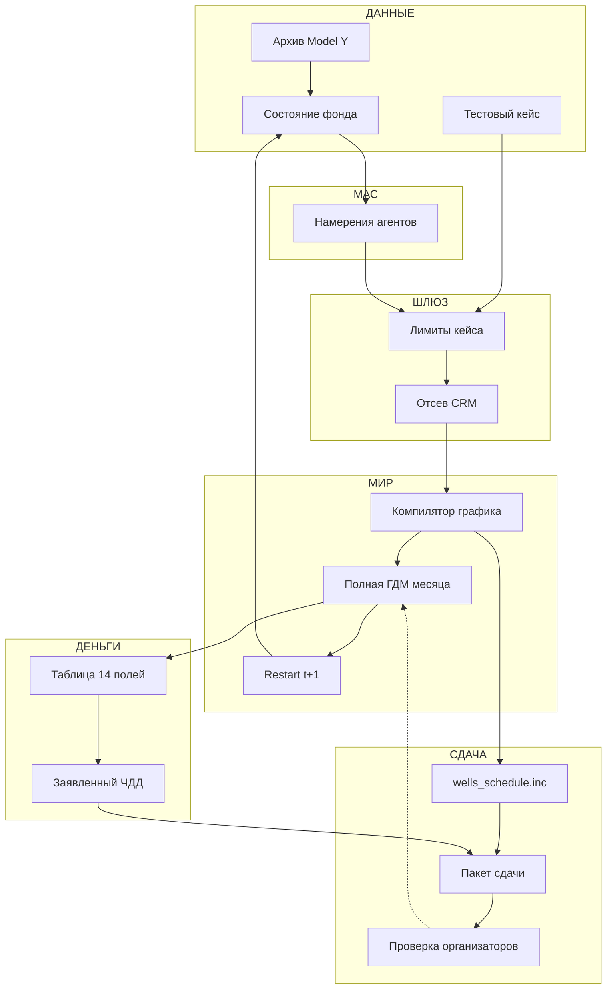

# T1 · рёбра flowchart (Model Y)

Источник фактов: `docs/hackathon/notes/tracks.md`, `submission.md`, `npv.md`, `dialog.md`, `models.md`.
Это **список стрелок**, не сетка карточек. Следующий агент рисует flowchart по таблице. Имена файлов не переименовывать.

Инварианты:

- Каждый **принятый** месяц — полный прогон ГДМ. CRM / LLM состояние не обновляют.
- ЧДД только `CHDD_PYTHON` с явным `--start-year 2014`. Других калькуляторов нет.
- Сдаваемый график — `wells_schedule.inc`, не CSV. Агенты пишут **действия**, не дебиты.
- TimesOil CRM / CRM2P / CRMP / Джентил — только отсев до ГДМ.
- Организаторы гоняют сданный график **один** раз. Расхождение с заявкой — дисквалификация.

Ленты сверху вниз (или колонки слева направо), тот же порядок: **ДАННЫЕ → МАС → ШЛЮЗ → МИР → ДЕНЬГИ → СДАЧА**.
Подпись узла — одна строка, русский, ≤40 символов. Не больше **16** рёбер.

---

## Путь

Месячный цикл (сплошные):

```
zip → state → intent → limits → crm → compile → gdm → restart → state
```

Вход лимитов (в тот же `limits`):

```
case → limits
```

Деньги (после ГДМ; ЧДД — по закрытому горизонту, не внутри месяца):

```
gdm → table → npv
```

Сдача:

```
compile → inc → pack ← npv
pack → jury → gdm
```

Последнее ребро (`jury → gdm`) — **один** прогон сданного `wells_schedule.inc` целиком. Не путать с помесячной петлёй `restart → state`.

---

## Узлы

| id | лента | подпись |
|---|---|---|
| zip | ДАННЫЕ | Архив Model Y |
| state | ДАННЫЕ | Состояние фонда |
| case | ДАННЫЕ | Тестовый кейс |
| intent | МАС | Намерения агентов |
| limits | ШЛЮЗ | Лимиты кейса |
| crm | ШЛЮЗ | Отсев CRM |
| compile | МИР | Компилятор графика |
| gdm | МИР | Полная ГДМ месяца |
| restart | МИР | Restart t+1 |
| table | ДЕНЬГИ | Таблица 14 полей |
| npv | ДЕНЬГИ | Заявленный ЧДД |
| inc | СДАЧА | wells_schedule.inc |
| pack | СДАЧА | Пакет сдачи |
| jury | СДАЧА | Проверка организаторов |

`CHDD_PYTHON` — машина на ребре `table → npv`, не отдельный узел.

---

## Рёбра

| # | from | to | подпись | payload | who_owns | файл |
|---|---|---|---|---|---|---|
| 1 | zip | state | deck и фонд | DATA, сетка 49×47×141, 49 скважин, START 01 MAY 2007 | загрузчик | `Model_Y (3).zip`, `MODEL_Y.DATA` |
| 2 | case | limits | лимиты теста | ограничения кейса; на тесте ждут лимит воды | организаторы | — |
| 3 | state | intent | состояние фонда | режимы, давления, WEFF, обводнённость | МАС | — |
| 4 | intent | limits | действия агентов | стоп, старт, режим, перевод; не дебиты и не ЧДД | МАС | — |
| 5 | limits | crm | допустимые | кандидаты после жёстких лимитов | шлюз | — |
| 6 | crm | compile | финалист месяца | слабые отсеяны; CRM не заменяет ГДМ | TimesOil CRM | — |
| 7 | compile | gdm | include месяца | DATES, WCONPROD, WCONINJE на принятый месяц | компилятор | `wells_schedule.inc` |
| 8 | gdm | restart | физика месяца | последствия действий; не прогноз TimesOil | ГДМ | `MODEL_Y.DATA` |
| 9 | restart | state | снимок t+1 | новое состояние только из ГДМ | ГДМ | — |
| 10 | gdm | table | строки месяца | DATA, well, WLPT…WWIT_Diff; нефть/жидкость — т, закачка — м³ | ГДМ | `script_1.py` |
| 11 | table | npv | ЧДД с 2014 | одно число, млн руб.; флаг обязателен | CHDD_PYTHON | `РАСЧЕТ_ЧДД.py`, `--start-year 2014` |
| 12 | compile | inc | полный график | накопленный include без ручной правки | компилятор | `wells_schedule.inc` |
| 13 | inc | pack | график в пакет | тот же файл, что в цикле | команда | `wells_schedule.inc` |
| 14 | npv | pack | ЧДД в пакет | заявленный ЧДД своего прогона | команда | — |
| 15 | pack | jury | пакет организаторам | график + заявленный ЧДД + код/UI | команда | `wells_schedule.inc` |
| 16 | jury | gdm | один прогон графика | сданный include целиком; тот же CHDD; без повтора | организаторы | `wells_schedule.inc` |

Ребро 16 пунктир / ржавчина. После их ГДМ снова идут 10 и 11; сверка с заявкой — смысл узла `jury`, не 17-е ребро.

---

## Mermaid (только эти стрелки)



---

## Запреты

- Не рисовать сетку 2×4 и не копировать `t1-layout.md` как чтение схемы.
- Не ставить CRM / LightGBM / Chronos / TiRex на место ГДМ или `CHDD_PYTHON`.
- Не считать Excel 2014–2015 целью; история до 01.01.2014 — старт, не оптимум.
- Не вводить Model Z, суррогат, `ControlIntent` как официальное имя файла.
- Не добавлять 17-е ребро, блок-агентов, no-op и коридор 0,85–1,15.
- Вспомогательные include архива (`DemoSpe_002_2_*.inc`) живут внутри `zip`, не отдельными узлами.
- `Нормативы_ЧДД.xlsx` и `ВХОДНОЙ_ФАЙЛ.txt` — вход калькулятора на ребре 11, не узлы.
