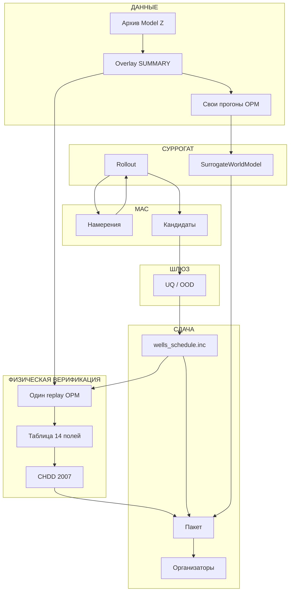

# T2 · рёбра потока (не сетка карточек)

Источник: `docs/hackathon/architecture_2026-08-17.md` (§ Model Z / Track 2, § Track 2), `docs/hackathon/notes/tracks.md`, `docs/hackathon/notes/npv.md`, `docs/hackathon/notes/models.md`.
Это **список стрелок** для блок-схемы со дорожками. Не IA-сетка 2×4 из `t2-layout.md`. Не писать SVG отсюда.

Инварианты (не выдумывать):

- Трек 2 = `Model_Z_final_OPM.zip`. **103 уникальные скважины**; 92 когда-либо добывающих, 41 когда-либо нагнетательная, 30 меняют роль (`92 + 41 - 30 = 103`). Не писать 109.
- Суррогат — **только поиск**. Заявленный ЧДД — **один** полный replay OPM/ГДМ (`GdmValidator`).
- Учёт ЧДД с **01.01.2007**. Флаг `--start-year 2007` обязателен. Без флага калькулятор берёт минимальный год данных (1991).
- **4418,13** (JSON со старта 1991) — не контроль трека 2.
- **TimesOil ≠ суррогат трека 2** (тот контур — Model Y, горизонт 6 месяцев). Ребра TimesOil → `SurrogateWorldModel` нет.
- Сдача: `wells_schedule.inc` + заявленный ЧДД + код/UI + суррогат и метрики.
- Организаторы гоняют сданный график **один** раз.
- Команда делает контрольный replay для физической верификации; сертификация
  результата выполняется организаторами после сдачи.

Официальные имена как есть: `Model_Z_final_OPM.zip`, `Model_Z_summary.inc`, `wells_schedule.inc`, `CHDD_PYTHON`, `РАСЧЕТ_ЧДД.py`, `SurrogateWorldModel`, `GdmValidator`.

Максимум **16** рёбер. Каждое: откуда, куда, груз, роль, файл.

---

## Дорожки и узлы

Чтение: сверху вниз по дорожкам, слева направо внутри. Петля поиска — только `A1` ↔ `S2`. На контрольный replay уходит **один** график.

| id | дорожка | узел |
|---|---|---|
| D1 | ДАННЫЕ | Архив Model Z |
| D2 | ДАННЫЕ | Overlay SUMMARY |
| D3 | ДАННЫЕ | Свои прогоны OPM |
| S1 | СУРРОГАТ | SurrogateWorldModel |
| S2 | СУРРОГАТ | Rollout |
| A1 | МАС | Намерения |
| A2 | МАС | Кандидаты |
| G1 | ШЛЮЗ | UQ / OOD |
| C1 | ФИЗИЧЕСКАЯ ВЕРИФИКАЦИЯ | Один replay OPM |
| C2 | ФИЗИЧЕСКАЯ ВЕРИФИКАЦИЯ | Таблица 14 полей |
| C3 | ФИЗИЧЕСКАЯ ВЕРИФИКАЦИЯ | CHDD 2007 |
| P0 | СДАЧА | wells_schedule.inc |
| P1 | СДАЧА | Пакет |
| P2 | СДАЧА | Организаторы |

---

## Рёбра

| # | от | к | груз | роль | файл |
|---:|---|---|---|---|---|
| 1 | D1 Архив Model Z | D2 Overlay SUMMARY | deck, 103 WELSPECS, START 01 JUN 1991 | вход; оригинал не менять | `Model_Z_final_OPM.zip` |
| 2 | D2 Overlay SUMMARY | D3 Свои прогоны OPM | SUMMARY-векторы, точка INCLUDE | дампов организаторов нет; гидродинамику снимает команда | `Model_Z_summary.inc` |
| 3 | D3 Свои прогоны OPM | S1 SurrogateWorldModel | траектории replay / импульс / Sobol / stop-start | обучение; сплит по целым сценариям, не по строкам | `.SMSPEC` / `.UNSMRY` |
| 4 | A1 Намерения | S2 Rollout | стоп, старт, режим, перевод | мир поиска = суррогат; LLM не пишет дебиты, давления, ЧДД | `ControlIntent` |
| 5 | S2 Rollout | A1 Намерения | траектория + черновик ЧДД | дешёвая оценка; **не** заявка | `РАСЧЕТ_ЧДД.py` |
| 6 | S2 Rollout | A2 Кандидаты | полные графики, WAPE, черновик ЧДД | много кандидатов на суррогате | `ScheduleArtifact` |
| 7 | A2 Кандидаты | G1 UQ / OOD | набор полных графиков | отбор одного; остальные отсекаются | `RiskAssessment` |
| 8 | G1 UQ / OOD | P0 wells_schedule.inc | один принятый план | компилятор; после сборки руками не правят | `wells_schedule.inc` |
| 9 | D2 Overlay SUMMARY | C1 Один replay OPM | SUMMARY-векторы, INCLUDE | тот же overlay, что для своих прогонов | `Model_Z_summary.inc` |
| 10 | P0 wells_schedule.inc | C1 Один replay OPM | полный график + неизменный deck | единственная физика заявки; `GdmValidator` | `Model_Z_final_OPM.zip` |
| 11 | C1 Один replay OPM | C2 Таблица 14 полей | DATA, well, WLPT, WLPR, WOMT, WOMR, WWIR, WWIT, THP, BHP, WEFF, WLPT_Diff, WOMT_Diff, WWIT_Diff | не из суррогата; WLPR ≤ 500 | overlay SUMMARY |
| 12 | C2 Таблица 14 полей | C3 CHDD 2007 | помесячная таблица, тонны / м³ | заявленный ЧДД; не 1991, не 4418 | `РАСЧЕТ_ЧДД.py` |
| 13 | C3 CHDD 2007 | P1 Пакет | одно число, млн руб. | заявка; флаг `--start-year 2007` | `ВХОДНОЙ_ФАЙЛ.txt` |
| 14 | P0 wells_schedule.inc | P1 Пакет | управляющий include | сдача, не CSV | `wells_schedule.inc` |
| 15 | S1 SurrogateWorldModel | P1 Пакет | веса, способ воспроизвести, WAPE | четвёртый выход; TimesOil не класть | метрики суррогата |
| 16 | P1 Пакет | P2 Организаторы | график + заявленный ЧДД + код/UI + суррогат | один ГДМ и тот же `CHDD_PYTHON`; расхождение — дисквалификация | `wells_schedule.inc` |

Петля 4–5 крутится, пока шлюз не взял одного кандидата. Рёбра 8–13 — один проход. Ребро 9 и ребро 2 делят один overlay: поиск и контрольный replay не меняют оригинальный архив.

---

## Схема

---

## Нет ребра

| от | к | почему |
|---|---|---|
| TimesOil CRM / LightGBM / Chronos / TiRex | S1 SurrogateWorldModel | другой контур: Model Y, 6 месяцев |
| S2 Rollout | C3 CHDD 2007 | черновик не заявляют |
| S2 Rollout | P2 Организаторы | суррогат не подтверждает физику плана |
| JSON 4418,13 / старт 1991 | P1 Пакет | не контроль трека 2 |
| C1 Один replay OPM | A1 Намерения | не помесячный цикл трека 1 |
| `РАСЧЕТ_ЧДД.py` без `--start-year` | заявленный ЧДД | без флага берётся 1991 |

Не добавлять 17-е ребро «код/UI»: исходники входят в груз ребра 16, отдельного узла нет.
Не ставить полную ГДМ в дорожки СУРРОГАТ и МАС.
Не подписывать 4418,13 как контроль. Не писать 109 скважин.
