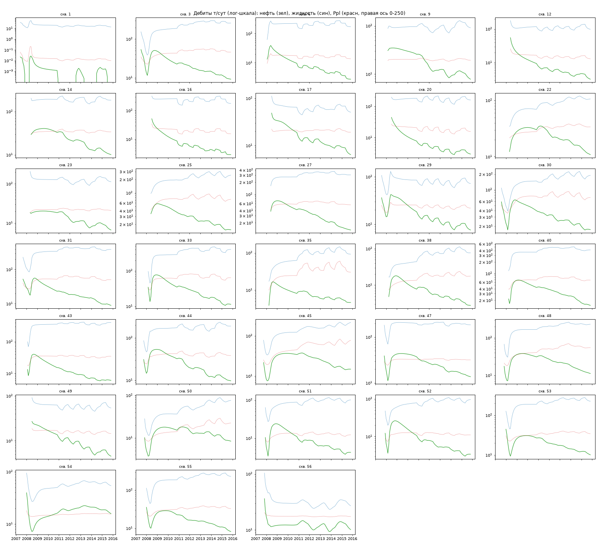
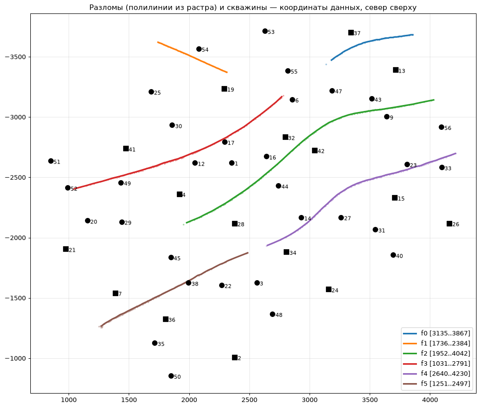
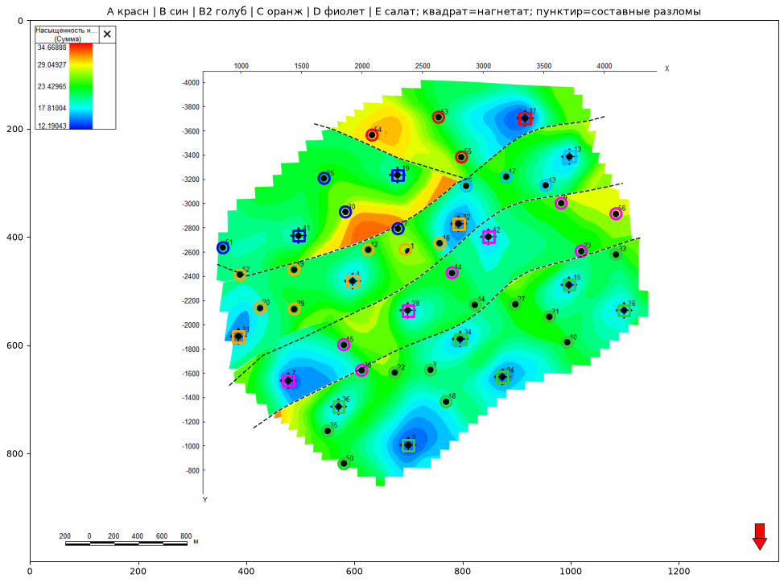
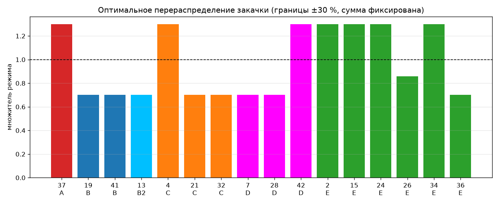
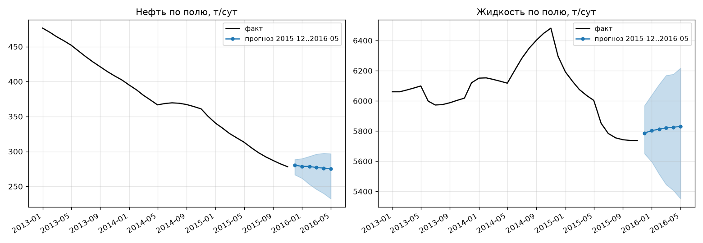

# TimesOil: полная история проекта — от исходных данных до финального прогноза

Дата: 2026-07-07. Все прогоны выполнены на сервере a100; репозиторий:
`github.com/DarkPrinceWarrior/TimesOil` (данные вне репозитория).

Документ описывает весь путь проекта подробно: какие данные получены и
какие ловушки в них найдены, как оцифрована карта разломов, какие модели
и почему проверялись, что показала каждая стадия, как устроен итоговый
ансамбль и прогноз вперёд, как всё воспроизвести.

---

## 1. Задача

По месячной истории работы месторождения (2007-05…2015-11) спрогнозировать
**среднесуточный дебит нефти и жидкости каждой из 33 действующих добывающих
скважин на 6 месяцев вперёд**. Заказчик предоставил два файла Excel (один
и тот же набор данных в двух форматах) и карту месторождения с разломами,
«обязательную к изучению». Модели, заданные изначально: TiRex-2 (NX-AI) и
SPDM (Гонконгский университет); далее набор расширялся по результатам.

Проверка качества — скользящая по историческим срезам: обучающая история
обрезается на дату среза, прогнозируются следующие 6 месяцев, сравнение с
фактом. Канонические срезы: **2014-05, 2014-11, 2015-05**; расширенный
набор для ансамбля и калибровки — **14 срезов** (2013-03…2015-05, шаг 2
месяца). Основная метрика — взвешенная абсолютная процентная ошибка:

$$\mathrm{WAPE} = \frac{\sum_{w,t}\left|q_{w,t}-\hat q_{w,t}\right|}{\sum_{w,t} q_{w,t}},$$

дополнительно — смещение суммарной добычи за горизонт
$\Delta_\Sigma$ и накрытие интервалов.

## 2. Данные и их ловушки

### 2.1. Что внутри

`Dataset.xlsx` (лист MODEL_Y) — длинный формат: 49 скважин × 104 месяца,
колонки дат, накопленных и месячных отборов, закачки, давлений, признака
работы WEFF. «Dataset Шутову АА+.xlsx» — те же величины матрицами
«месяц × скважина» (листы DobN, DobG, Ppl, Pz, Pnag, NagV) плюс статика
скважин (DobXY: проницаемость 4–90 мД, пористость 0.18–0.25, эффективная
толщина ~36–41 м, глубины), список нагнетательных (ZakXY) и траектории
стволов. Численная сверка всех пяти матриц двух файлов показала
**тождественность** — расхождений нет.

Источник — гидродинамический симулятор (обозначения сводных векторов
Эклипса на служебном листе, гладкие кривые, непрерывная работа скважин).

**Фонд**: 33 постоянные добывающие + 16 нагнетательных, из которых 15
переведены из добычи в 2008-02…2008-07 (по 2–10 месяцев добычи до
перевода), а скв. 19 — нагнетательная с самого начала.

**Стадия разработки** — позднее заводнение: пик нефти в 2009 году
(370 тыс. т/год), к 2015 — ~102 тыс. т за 11 месяцев; обводнённость
0.90–0.98 у большинства скважин; жидкость на полке 2.2–2.3 млн т/год;
объёмная компенсация закачкой ≈ 100 %.



### 2.2. Ловушки данных (все выявлены сверкой и физическими проверками)

1. **Последний месяц (2015-12) — артефакт выгрузки**: гигантские
   отрицательные «добычи» (разности накопленных при обнулении), нулевые
   давления, плюс полностью пустая строка в MODEL_Y. Рабочая история —
   по 2015-11.
2. **Колонка «THP» — на самом деле пластовое давление**: тождественна
   листу Ppl; у добывающих «THP» (90–140 атм) выше забойного (20–60 атм) —
   для устьевого это физически невозможно, для пластового естественно.
3. **Лист DobG — жидкость, а не газ** (тождественен «Добыче жидкости, т.»).
4. **Нули до пуска скважины** означают «скважины ещё нет» (WEFF = 0),
   а не нулевую добычу — для моделей это пропуски.
5. **Переводы под нагнетание**: 15 скважин в 2008; их короткие добычные
   истории в обучение не идут, но их закачка — ключевой внешний фактор.
6. **Календарный эффект**: месячные тонны зависят от числа дней месяца
   (провал каждый февраль) — прогнозируются среднесуточные дебиты
   $q = M_{\text{мес}}/n_{\text{дней}}$.
7. **Единицы**: добыча в тоннах, закачка в кубометрах.
8. **Скв. 1 полностью обводнена** (нефть ≈ 0 при 13.7 т/сут жидкости) —
   MAPE вырождается, поэтому WAPE.
9. **Закачка кусочно-постоянна** (плановый режим ППД) — идеальный
   «известный наперёд» сопутствующий ряд.
10. **2015 год: снижение закачки и жидкости** (~−5 %) — управляющее
    воздействие, которое модели без сопутствующих рядов не видят.

## 3. Карта и разломы: оцифровка

Карта — распределение нефтенасыщенности с фондом скважин (чёрные точки —
добывающие, символы со стрелками — нагнетательные) и белыми следами
разломов. Оцифровка полностью программная:

1. **Привязка растра к координатам**: на карте детектированы 33 чёрные
   точки добывающих (связные компоненты нужной формы), аффинное
   преобразование «пиксели → метры» подобрано итеративным сопоставлением
   с известными координатами скважин; медианная ошибка привязки —
   **0.45 пикселя**.
2. **Следы разломов**: светлые пиксели внутри контура поля,
   кластеризация с анизотропной метрикой (вдоль простирания связываем,
   поперёк — нет) — шесть трасс; по увеличенным фрагментам восстановлены
   кулисные сочленения (северная пара f1+f0, южная f5+f4), тройной узел
   у скв. 6 и юго-западное продолжение сквозного разлома f2.
3. **Блоки**: классификация скважин по сторонам составных кривых —
   **6 гидродинамических блоков** (A, B, B2, C, D, E). Приразломные
   скважины (< 60 м: 52, 38, 17, 23, 49, 6) отнесены по увеличенным
   фрагментам карты вручную.




**Подтверждение данными**: ёмкостно-резистивная модель всего поля без
блоковых ограничений сосредоточила **66.7 %** суммарной межскважинной
связности внутри блоков при доле внутриблочных пар 21.4 % — концентрация
в 3.1 раза. Разломная сеть, снятая с картинки, подтверждена независимо
динамикой добычи.

## 4. Этап 1: заданные модели и эталоны

Проверены: наивный прогноз, экспонента, гиперболический Арпс
$q(t)=q_i(1+bD_it)^{-1/b}$; TiRex-2 (предобученная xLSTM, без дообучения,
шесть конфигураций подачи данных); SPDM/ManiMamba (обучение с нуля на
a100; попутно исправлены три дефекта их репозитория — отсутствующие
модули конфигурации, несовместимость частоты с новыми pandas, битый путь
контрольной точки).

Ключевые находки этапа (WAPE, 3 среза × 6 мес):

| Модель | Нефть | Жидкость |
|---|---|---|
| TiRex-2 с закачкой по блокам (blocks_cov) | **0.083** | **0.077** |
| Арпс | 0.094 | 0.103 |
| SPDM | 0.100 | 0.125 |
| Наивный | 0.101 | 0.132 |
| TiRex-2 без сопутствующих рядов | 0.091 | 0.135 |

Уроки: (1) **закачка как известный план — главный фактор** (жидкость
13.4 → 7.7 %); (2) **блоки несут сигнал** — та же закачка без разбивки по
блокам хуже (9.0/8.6 % против 8.3/7.7 %); (3) обучаемой глубокой модели
(SPDM) не хватает данных: ~20 обучающих окон против тысяч в статьях.

## 5. Этап 2: физическая обвязка

По итогам разбора 12 статей папки `papers/` и веб-разведки реализованы:

1. **Ёмкостно-резистивная модель** (CRM, библиотека pywaterflood),
   подгонка по блокам:
   $$\tau_j\frac{dq_j}{dt}+q_j(t)=\sum_i f_{ij}\,I_i(t),$$
   жидкость **4.38 % WAPE** (было 7.7 %); её прогноз дополнительно
   подаётся в предобученные модели как известный наперёд ряд.
2. **Адресная закачка**: веса гидропроводности
   $w_{ij}\propto \bar k_{ij}/d_{ij}^2$ — лучше блочных сумм, но слабее
   ряда CRM.
3. **Фракционная модель Джентила**: $f_o = 1/(1+\alpha W^\beta)$ по
   накопленной адресной закачке; **нефть = жидкость × доля нефти —
   6.40 % WAPE** (было 7.8 %); согласованность нефть ≤ жидкость
   гарантирована конструкцией.
4. **Конформная калибровка интервалов** по 14 срезам: накрытие
   80-процентного интервала жидкости 0.59 → 0.73.

## 6. Этап 3: оптимизация распределения закачки

Стек CRM × Джентил использован как быстрая замена симулятора: при
фиксированной суммарной закачке множители режима 16 нагнетательных
оптимизированы последовательным квадратичным программированием:
**+1 384 т нефти (+2.75 %) за полугодие при границах ±20 % и +2 059 т
(+4.09 %) при ±30 %**. Решение интерпретируемо: вода снимается с промытых
блоков B/B2/C и переносится в блоки E и A.



## 7. Этап 4: переносимость на открытые полигоны

| Полигон | Характер данных | Лучшая модель (нефть) |
|---|---|---|
| Наше поле | гладкий симулятор, плановая закачка | физика CRM × Джентил (6.4 %) |
| UNISIM-I-H (14+11 скв., шум наблюдений) | зашумлённый симулятор | TiRex-2 (15.6 %) |
| Volve (Equinor, реальный промысел) | простои, смены режимов | наивный по WAPE; TiRex-2 по смещению |

Дополнительно: на Volve **учёт наработки часов** (дебит на отработанные
сутки) снял треть ошибки по нефти (0.32 → 0.24) и половину по жидкости
(0.25 → 0.13); на UNISIM компенсация забойного давления в CRM не помогла
(27.7 % против 26.2 %) — определяющие факторы там шум и короткое общее
окно фонда. Главный вывод: **лучшая модель зависит от характера данных;
контур делает выбор объективным за один прогон**.

## 8. Этап 5: расширение набора моделей и ансамбль

Проверка внешнего обзора предобученных моделей по первоисточникам
(документ `обзор_моделей_и_библиотек_2026-07.md`): Toto 2.0 — без
сопутствующих рядов (не кандидат), Timer-S1 — без них же и 40 ГБ
видеопамяти, MS-FLOW не существует; главный пропуск обзора — **Chronos-2**
(нативные ковариаты, № 1 на fev-bench). Из библиотек взяты: mlforecast
(LightGBM), neuralforecast (лёгкие сети), инфраструктурные идеи darts.

Результаты на нашем поле (WAPE, 3 канонических среза):

| Модель | Нефть | Жидкость |
|---|---|---|
| **Ансамбль (NNLS, веса без утечки)** | **0.0510** | **0.0387** |
| CRM × Джентил / CRM | 0.0640 | 0.0438 |
| Chronos-2 cov_crm | 0.0673 | 0.0541 |
| LightGBM (глобальный, с закачкой и CRM) | 0.0781 | 0.0438 |
| TiRex-2 blocks_cov_crm | 0.0783 | 0.0480 |
| TiDE (сеть, neuralforecast) | 0.0817 | 0.1068 |

На 14 срезах ансамбль даёт 4.67 % (нефть) и 3.36 % (жидкость). Веса
итоговые (неотрицательная регрессия): нефть — Chronos-2 0.31, CRM ×
Джентил 0.27, TiDE 0.22, TiRex-2 0.11, LightGBM 0.10; жидкость —
LightGBM 0.28, Chronos-2 0.26, TiRex-2 0.24, CRM 0.21. Все компоненты
вносят ненулевой вклад — их ошибки разнородны, в этом источник выигрыша.

Отрицательные результаты зафиксированы честно: BiTCN разошлась (NaN),
NHITS не прошла отсев, обучаемые модели (SPDM, LightGBM, сети) не
переносятся на полигоны без достаточной локальной истории.

## 9. Финальный прогноз вперёд (2015-12…2016-05)

Прогноз ансамблем с итоговыми весами; закачка — продлённый последний
режим (при получении реального плана ППД он подставляется в один вход);
интервалы 80 % — эмпирические мультипликативные по горизонтам из остатков
ансамбля на 14 срезах. По полю (т/сут; в скобках 80-процентный интервал):

| Месяц | Нефть | Жидкость |
|---|---|---|
| 2015-12 | 280 (267–289) | 5787 (5650–5970) |
| 2016-01 | 279 (262–290) | 5803 (5595–6041) |
| 2016-02 | 279 (253–293) | 5813 (5514–6110) |
| 2016-03 | 277 (246–296) | 5821 (5446–6169) |
| 2016-04 | 276 (240–298) | 5825 (5407–6177) |
| 2016-05 | 275 (233–297) | 5832 (5352–6218) |

Поскважинные значения:
`results/forward_oil_tpd.csv`, `results/forward_liq_tpd.csv`; компоненты —
`results/forward_components_*.csv`; графики по всем 33 скважинам — PDF
`отчёт_приложение_скважины.pdf`.



## 10. Структура репозитория и воспроизведение

```
src/timesoil/          данные и модели
  data.py              загрузка/очистка (все ловушки задокументированы)
  wells.py             фонд, 6 блоков разломов (оцифровка)
  crm.py               ёмкостно-резистивная модель (+CRM-P)
  allocation.py        адресная закачка (гидропроводность)
  fractional.py        фракционная модель Джентила
  tirex_runner.py      TiRex-2 c ковариатами (группы скважин)
  chronos_runner.py    Chronos-2 (табличный интерфейс)
  mlprep.py            признаки для обучаемых моделей
  baselines.py, metrics.py, backtest.py
  unisim.py, volve.py  полигоны переносимости
scripts/               точки входа (бэктесты, калибровка, оптимизация,
                       расширенная проверка, ансамбль, прогноз вперёд,
                       сводка, графики, PDF)
docs/                  отчёты, обзор, журнал (roadmap.md), figures/
raw_data/, data/, results/   вне git (передаются scp)
external/              изолированные окружения (SPDM, neuralforecast) на a100
```

Порядок воспроизведения (всё на a100, правки локально → git):
`run_baselines` → `run_crm` → `run_tirex` → `run_chronos` → `run_lgbm` →
`run_nf` (venv сетей) → `calibrate_intervals` → `run_extended` →
`run_ensemble` → `forecast_forward_nf` + `forecast_forward` →
`collect_results` → `make_figs` → `make_pdf`. Полигоны: `run_unisim`,
`run_volve`, `run_volve_uptime`. Оптимизация закачки: `optimize_injection`.

## 11. Реестр инженерных «граблей» (помимо ловушек данных)

- SPDM: отсутствующие модули конфигов; частота «m» несовместима с pandas
  2.3 (нужна «ME»); при малом батче валидационный загрузчик пуст
  (drop_last) и обучение молча ломается; путь контрольной точки в predict
  битый; директория `wheels/` из их README не существует.
- pywaterflood: полевой CRM без ограничений — только для проверки блоков;
  прогнозная подгонка — по блокам.
- mlforecast: окна кросс-валидации строятся от конца **каждого** ряда —
  скважины, остановленные раньше общего конца, надо исключать.
- neuralforecast: TimeXer без известных наперёд рядов (вопреки статье),
  DeepAR без исторических, PatchTST/iTransformer без ковариат вовсе;
  TSMixerx мультивариатная (требует полную панель); BiTCN на наших данных
  разошлась; окружение несовместимо с TiRex-2 по torch — отдельный venv.
- darts: обёртка TiRex — это TiRex-1 без ковариат; Python 3.13 — только с
  пином numba.
- uv: `uv sync` без `--extra tirex` удаляет tirex-2/chronos из окружения.
- Волатильная мелочь: месячные метки — начала месяцев у нашего поля и
  Volve, концы — у UNISIM; scp вместо rsync на сервере; веса HF — за
  токеном (gated).

## 12. Ограничения и продолжение

- Прогноз условен на план закачки; реальный план ППД на 2015-12…2016-05
  стоит запросить, как и векторные полигоны разломов.
- Интервалы 80 % калиброваны по 14 срезам одного месторождения;
  остаточное недокрытие возможно при смене режима.
- Оптимизацию закачки имеет смысл повторить поверх ансамбля (сейчас —
  поверх CRM × Джентил) и подтвердить гидродинамической моделью.
